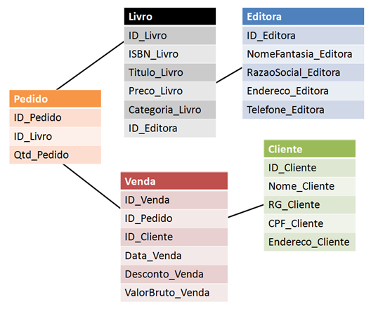

# O que são Banco de Dados?

## Definição

O que é um Banco de Dados? Um banco de dados é uma **coleção organizada de dados**, geralmente armazenada e acessada eletronicamente por um sistema de computador.

## Propósito

> Os dados são armazenados em uma estrutura que facilita a recuperação, atualização e manipulação de informações. Ele permite o **armazenamento, a recuperação e a manipulação eficiente de grandes volumes de informações**.

_(ELMASRI e NAVATHE, 2010)._

**Armazenamento de Dados:** Permitir o armazenamento de grandes quantidades de dados de maneira estruturada.

**Gerenciamento de Dados:** Facilitar a gestão e a manipulação dos dados para gerar relatórios, consultas e análises.

**Integridade e Segurança:** Garantir a integridade dos dados e a segurança contra acessos não autorizados.

**Acesso Rápido e Eficiente:** Proporcionar métodos rápidos e eficientes para acessar e manipular os dados.

**Observações:**

- **Dado:** É a menor parte da informação.

- **Informação:** É formado por um conjunto de dados.

- **Minimundo:** O contexto que o banco de dados representa aspectos do mundo real.

## Utilização

- Sistemas de gestão de clientes (CRM);
- Sistemas de gerenciamento de estoque;
- Bancos de dados financeiros;
- Sistemas de e-commerce.

---

# História e Evolução dos Bancos de Dados

## Era Pré-relacional

- **1960 - 1970:** Os primeiros sistemas de bancos de dados eram baseados em **hierarquias e redes**. Ex.: **IMS** da IBM (hierárquico) e o **CODASYL DBTG** (em rede).

- **1970 - 1980:** Introdução do modelo relacional por **Edgar F. Codd**. Onde, **os dados são armazenados em tabelas** e podem ser manipulados usando **SQL (Structured Query Language)**. Ex.: **Oracle**, **IBM DB2** e **Microsoft SQL Server**.

## Era Pós-relacional

- **1990 - 2000:** Evolução dos sistemas relacionais para suportar **grandes volumes de dados e transações complexas**. Surgimento de novos conceitos como transações distribuídas e bancos de dados orientados a objetos.

## Era NoSQL e Big Data

- **2000 - Presente:** Crescimento de bancos de dados **NoSQL para lidar com grandes volumes de dados** não estruturados e semiestruturados. Ex: **MongoDB**, **Cassandra** e **Redis**. A ascensão do Big Data e da análise de dados em larga escala trouxe novas tecnologias e ferramentas. Ex.: **Hadoop** e **Spark**.

---

# Banco de Dados Relacional

Um banco de dados relacional é um banco de dados que modela os dados de uma forma que eles sejam percebidos pelo usuário como **"tabelas"**, ou mais formalmente **"relações"**.

## SGBD

Um **Sistema de Gerenciamento de Banco de Dados (SGBD)** é um software que fornece a interface entre o usuário e o banco de dados. Ele permite criar, manter e manipular bancos de dados de maneira eficiente e segura. Ex.: **MySQL** e **PostgreSQL** são exemplos de SGBDs relacionais. **MongoDB** e **Redis** são exemplos de SGBDs não relacionais (NoSQL).

### Objetivos e Vantagens

O uso de um banco de dados oferece várias vantagens em relação ao gerenciamento de dados em arquivos simples. Algumas das principais vantagens são:

- **Redução de Redundância:** Ao armazenar dados de forma estruturada, um banco de dados evita a duplicação de informações.

- **Integridade dos Dados:** Garantia de que os dados sejam válidos e consistentes, por meio de regras de integridade (como chaves primárias e estrangeiras).

- **Acesso Rápido e Eficiente:** Através de índices e otimizações, os SGBDs permitem consultas rápidas e eficientes.

- **Segurança:** Os bancos de dados podem ser configurados com permissões de acesso, garantindo que apenas usuários autorizados possam acessar ou modificar os dados.

- **Backup e Recuperação:** Bancos de dados podem ser configurados para realizar backups automáticos e garantir que os dados possam ser recuperados após Falhas.

---

# Sistema de Gerenciamento de Arquivos X Banco de Dados

Um sistema de gerenciamento de arquivos simples não possui as funcionalidades avançadas de um SGBD. Ele apenas armazena dados em arquivos, sem controle de integridade, segurança ou facilidade de acesso.

## Sistema de Arquivos

- Dados armazenados em arquivos separados.

- Acesso ao dado é feito diretamente via sistema operacional.

- Não há controle rigoroso sobre a integridade e segurança dos dados.

## Banco de Dados

- Dados são armazenados de maneira estruturada, muitas vezes em tabelas.

- O SGBD oferece interface para consultar, modificar e gerenciar dados de forma eficiente.

- Há garantias de integridade, segurança e acesso concorrente.

**Exemplos:**

**Sistema de Arquivos:** Uma loja de música mantém a lista de músicas em arquivos de texto ou planilhas. A loja tem dificuldade em manter esses arquivos atualizados, e é fácil cometer erros ao inserir ou consultar dados.

**Banco de Dados:** Uma loja online usa um banco de dados para armazenar informações de clientes, produtos e pedidos. A loja tem mecanismos que garantem que os dados não sejam corrompidos ou duplicados, e é possível realizar consultas complexas de forma rápida.

---

# Tipos de Dados e Tipos de SGBD

Existem vários tipos de bancos de dados, e eles podem ser categorizados conforme a estrutura de dados que utilizam.

**Relacional:** Os dados são armazenados em tabelas e são acessados usando SQL. É o modelo mais comum de SGBD. Ex.: **MySQL**, **PostgreSQL**.

**NoSQL:** Bancos de dados não-relacionais, que não usam o modelo tabular tradicional. São usados para grandes volumes de dados não estruturados ou semi-estruturados. Ex.: **MongoDB** (documento), **Cassandra** (coluna), **Redis** (chave-valor).

**Orientado a Objetos:** Bancos de dados que armazenam dados como objetos, similar à programação orientada a objetos. Ex.: **ObjectDB**, **db40**.

**Hierárquico:** Dados são organizados em uma estrutura de árvore. Cada registro possui um único pai. Ex.: **IBM IMS**.

**Em Rede:** Semelhante ao hierárquico, mas permite que um registro tenha múltiplos pais. Ex.: **Integrated Data Store (IDS)**.
