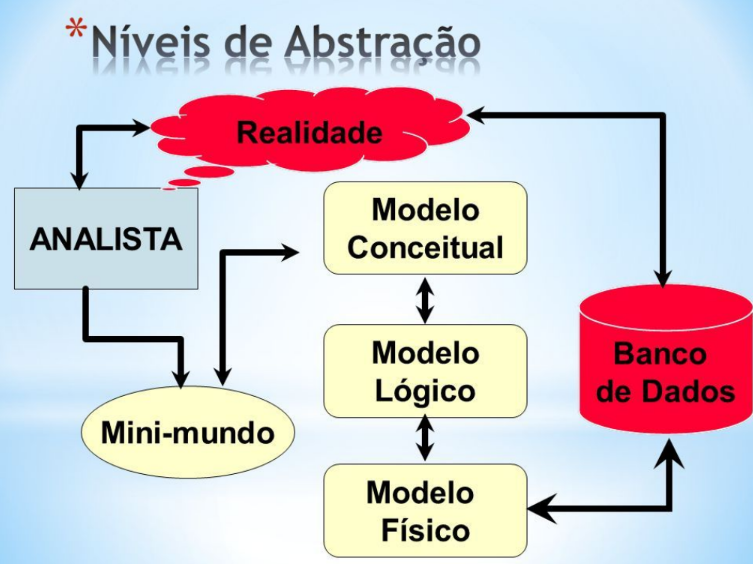
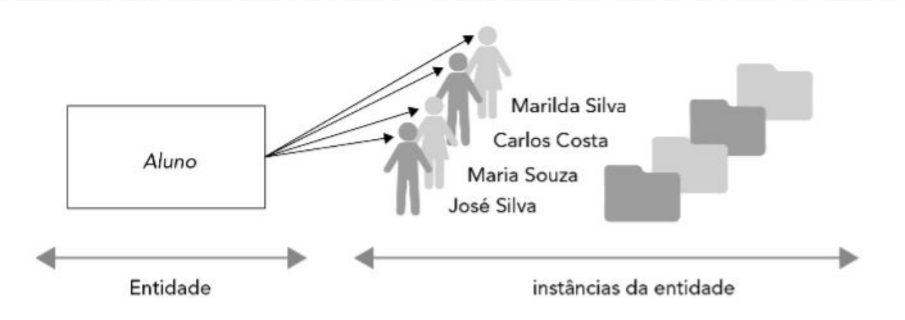
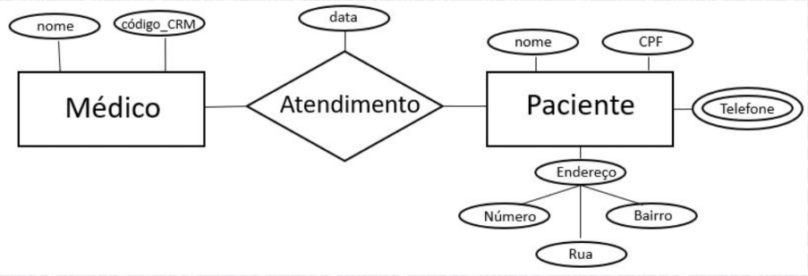

# Modelagem de Dados

## Definição

Modelagem de dados é o processo de criar um modelo para **organizar e estruturar dados**, de forma que eles possam ser acessados, **manipulados** e **utilizados** com eficiência em sistemas.

## Níveis de Modelagem

Existem três níveis de modelagem: Conceitual, Lógica e Física.

### Conceitual

- **Visão de alto nível**. Não se preocupa com o detalhes específicos do banco de dados ou sistema.

- **Representação abstrata dos dados**.

- **Foco em entidades e relacionamentos**, sem o detalhes técnicos.

**Exemplo:** Diagrama com clientes e pedidos, sem indicar chaves ou tipos de dados.

### Lógica

- **Representação dos dados considerando regras de negócio e estrutura relacional**.

- Definição de **chaves primárias** e **estrangeiras**.

- **Exemplo:** Diagrama com chaves primárias e relações normalizadas.

### Física

- **Implementação do modelo lógico no banco de dados**.

- Definição de **tabelas**, **tipos de dados**, **índices** e **constraints**.

- **Exemplo:** Script SQL para criar as tabelas.

---

# Modelo Entidade-Relacionamento (MER)

O **Modelo Entidade-Relacionamento (MER)** é uma técnica usada para representar graficamente a estrutura de um banco de dados. Ele descreve as entidades, seus atributos e os relacionamentos entre elas, visando a organização e a compreensão dos dados que serão armazenados em um sistema de banco de dados. Onde:

**Entidades:** Representam objetos do mundo real (Ex.: Cliente, Pedido).

**Atributos:** Características das entidades (Ex.: Nome, CPF, Data do Pedido).

**Relacionamentos:** Ligação entre entidades (Ex.: Cliente faz Pedido).

> O modelo entidade-relacionamento **foi definido por Peter Chen em 1976 e teve como base a teoria relacional criada por E. F. Codd (1970)**.

## Entidades

Uma entidade representa um objeto ou conceito distinto e identificável no minimundo sobre o qual você está construindo seu banco de dados.

Em termos simples, uma entidade é algo sobre o qual você deseja armazenar informações.

Por exemplo, em um sistema de gerenciamento de biblioteca, entidades podem incluir Livro, Autor, Leitor e Empréstimo.

### Identificação

**Identifique Substantivos**. Comece examinando a descrição do minimundo ou o problema que está sendo abordado.

Identifique todos os **substantivos que representam objetos, conceitos ou pessoas**.

Por exemplo, em um sistema de vendas online, você pode encontrar os substantivos: Produto, Cliente, Pedido, etc.

**Considere a Identificação Única:**

Pense em quais características únicas cada objeto ou conceito possui, que poderiam servir como identificador único para essa entidade.

Por exemplo, em uma escola, **cada Aluno pode ser identificado exclusivamente por seu número de matrícula**.

### Tipos

- **Entidades Fortes:** Existem independente de outras entidades.

- **Entidades Fracas:** Dependem de outras entidades para poderem existir.

- **Entidade Associativa (Verbo):** Surge da necessidade de relacionar uma Entidade a outra Entidade.

## Atributos

Todo objeto, para ser uma entidade, possui propriedades que são descritas por atributos. Atributo é um dado que é associado a cada ocorrência de uma entidade ou de um relacionamento.

### Classificação

**Simples:** Recebe um único valor (atributo: nome, sexo, etc) e não é um atributo identificador. A maioria dos atributos são simples.

**Composto:** O seu conteúdo é formado por vários itens de dados menores, ou seja, outros atributos. Ex.: Endereço (rua, número, bairro, cidade, uf).

**Multivalorado:** O seu conteúdo é formado por mais de um valor. Telefone (residencial, comercial, etc), Especialidade médica (cardiologista, pediatra, etc).

**Derivado:** Possui relação entre si. Ex.: Idade é derivada da Data de nascimento de uma pessoa.

**Identificador ou chave:** Identifica de forma única uma entidade, ou seja, não podem existir valores repetidos para esse atributo. Ex.: CPF, matrícula, CRO, CRM, código de funcionário, etc.

## Relacionamento (Verbo)

Relacionamentos entre entidades representam como elas se conectam.
Exemplo: Um Cliente **faz** um Pedido.

No Modelo Entidade-Relacionamento (MER), entidades são objetos do mundo real, e o relacionamento entre elas indica uma ação. O verbo expressa esse vínculo, como em: As pessoas **moram** em apartamentos.

### Tipos

**Relacionamentos condicionais:** Ocorre quando uma entidade pode ou não se relacionar com outra. Exemplo: Cliente faz um Pedido.

- Um cliente pode existir sem ter feito nenhum pedido.
- No MER, isso é representado por uma cardinalidade mínima de 0.

A entidade **pode ou não participar** do relacionamento.

**Relacionamentos incondicionais:** Ocorre quando a existência de uma entidade depende obrigatoriamente da existência de outra. Exemplo: Funcionário trabalha para uma Empresa.

- Todo funcionário precisa estar vinculado a uma empresa.
- No MER, isso geralmente aparece como uma cardinalidade mínima de 1.

A entidade **sempre** participa do relacionamento.

### Grau de Relacionamento (Cardinalidade)

Representa a quantidade de instâncias de uma entidade que pode se associar a uma instância de outra entidade.

#### Um-para-Um (1:1)

Neste grau de relacionamento, cada elemento de uma entidade relaciona-se com um e somente um elemento de outra entidade. Exemplo: Um funcionário **tem um** crachá exclusivo.

#### Um-para-Muitos (1:N)

Neste grau de relacionamento é o mais comum no mundo real e o que se denomina relacionamento básico entre entidades. Exemplo: Um cliente pode **fazer vários** pedidos.

#### Muitos-para-Muitos (N:M)

Neste grau de relacionamento, onde N elementos de uma entidade relaciona-se com M elementos de outra entidade. Exemplo: Vários alunos podem **se inscrever em vários**
cursos.
