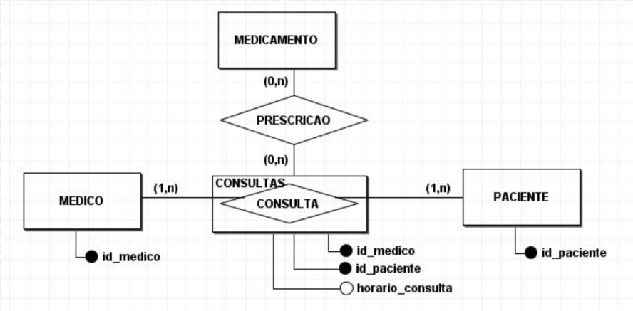
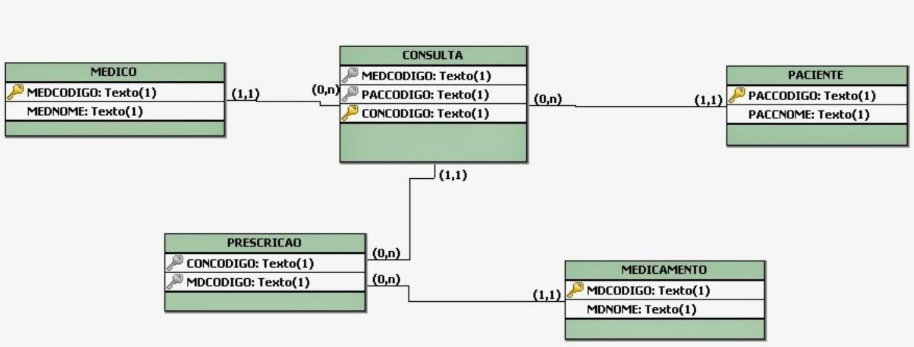

# Normalização

**Normalização** é o processo de **organização de dados** em um banco de dados, que envolve a criação de tabelas e o **estabelecimento de relações** entre essas tabelas conforme as regras projetadas para **proteger os dados** e tornar o banco de dados mais flexível, **eliminando a redundância e as dependências inconsistentes**.

## Formas Normais

### Primeira Forma Normal (1FN)

A 1FN é um estado de organização de dados em um banco de dados relacional, onde cada coluna em uma tabela contém **valores atômicos e indivisíveis**, ou seja, valores simples que não podem ser divididos em partes menores significantes. Em outras palavras, **uma tabela está na 1FN se e somente se não contiver grupos repetidos de colunas ou múltiplos valores em uma única célula**.

**Exemplo:**

**Sem 1FN**

| MatrículaId | Nome      | Cursos               |
| :---------- | :-------- | :------------------- |
| 001         | Ana       | Matemática, História |
| 002         | João      | Inglês, Ciências     |
| 003         | Elizabeth | Matemática           |

**Com 1FN**

| MatrículaId | Nome      |
| :---------- | :-------- |
| 001         | Ana       |
| 002         | João      |
| 003         | Elizabeth |

| CursoId | Nome do Curso |
| :------ | :------------ |
| 001     | Matemática    |
| 002     | História      |
| 003     | Inglês        |

- Todos os atributos precisam ser simples.

Ao identificar atributos **multivalorados** e/ou **compostos**. O atributo **deve ser retirado da entidade de origem**, criando uma nova entidade, que deverá estar relacionada com a entidade de origem. **A nova entidade terá como parte de seu "Identificador único concatenado" o atributo "Identificador único" da entidade de origem**.

### Segunda Forma Normal (2FN)

Um modelo atende à Segunda Forma Normal (2FN) se:

1. Já estiver na 1FN.

2. Todos os atributos que não fazem parte da chave primária dependerem inteiramente dela, sem dependências parciais.

Para entender a 2FN, é importante compreender o conceito de **dependência funcional (DF)**, também chamado de determinante.

A **dependência funcional ocorre quando um atributo identifica de forma única os outros dados de uma tabela**. Por exemplo, em uma faculdade, dois alunos podem ter o mesmo nome, como Júlio de Melo. Se a instituição precisar registrar notas e frequência, o nome não é suficiente para identificar cada aluno de forma única.

Por isso, um atributo como Matrícula é necessário para diferenciar os alunos e garantir a correta associação dos dados. Assim, um atributo (como Matrícula) determina os demais, evitando ambiguidades no banco de dados.

### Terceira Forma Normal (3FN)

Um modelo atende à Terceira Forma Normal (3FN) se:

1. Já estiver na 2FN.

2. Todos os seus atributos não identificadores da entidade sem dependência transitiva em si.

**Sem 3FN**

| CursoID | Cursos     | MatrículaProf | Professor |
| :------ | :--------- | :------------ | :-------- |
| 001     | Matemática | 20            | André     |
| 002     | História   | 21            | Suelen    |
| 003     | Inglês     | 22            | Mônica    |

**Com 3FN**

| MatrículaProf | Professor |
| :------------ | :-------- |
| 20            | André     |
| 21            | Suelen    |
| 22            | Mônica    |

| CursoId | Cursos     | MatrículaProf |
| :------ | :--------- | :------------ |
| 001     | Matemática | 20            |
| 002     | História   | 21            |
| 003     | Inglês     | 22            |

---

# Modelo Lógico

O **modelo lógico** já leva em conta algumas limitações e implementa recursos como adequação de padrão e nomenclatura, define as **chaves primárias e estrangeiras**, **normalização**, entre outras. Para o modelo lógico deve ser criado levando em conta os exemplos de modelagem de dados criados no modelo conceitual.

## Chaves

### Chave Primária (PK)

**Chave Primária:** Este é um tipo de chave, refere-se a campos que podem ser simples, ou um conjunto de campos, não se repetem e não podem ser nulos. Também conhecida como **Primary Key (PK)**.

### Chave Estrangeira (FK)

**Chave Estrangeira:** Este é um tipo de chave utilizado para fazer o relacionamento entre as tabelas. Também conhecida como **Foreign Key (FK)**.

**Exemplo:**

| (PK) MatrículaProf | Professor |
| :----------------- | :-------- |
| 20                 | André     |
| 21                 | Suelen    |
| 22                 | Mônica    |

| CursoId | Cursos     | (FK) MatrículaProf |
| :------ | :--------- | :----------------- |
| 001     | Matemática | 20                 |
| 002     | História   | 21                 |
| 003     | Inglês     | 22                 |

---

# Regras de Conversão

1. Todas as entidades se transformam em tabelas;
2. Os relacionamentos N:N se transformarão em tabelas (associativas) com chave primária concatenada. Formada pela chaves primárias das tabelas envolvidas no relacionamento;
3. Todo atributo identificador será transformado em chave primária;
4. Não existem relacionamento N:N no modelo lógico, eles se transformarão em dois relacionamentos 1:N.
5. Nos relacionamentos 1:N a chave primária da entidade cuja a cardinalidade máxima é 1, deve migrar para a tabela que tem cardinalidade máxima N. Servindo de elo entre as duas tabelas.
6. Em caso de especialização ou generalização, podem surgir outras tabelas, ou os atributos das tabelas específicas vem para dentro da tabela original.
7. Quando temos relacionamentos 1:1 , podem acontecer três coisas:
   1. As entidades do relacionamento podem virar uma só;
   2. As entidades do relacionamento podem se comportar como um relacionamento 1:N com chaves distintas;
   3. Elas podem se transformar em um relacionamento 1:1 porém com
      chaves iguais;

# Modelos

## Modelo Conceitual

## Modelo Lógico

