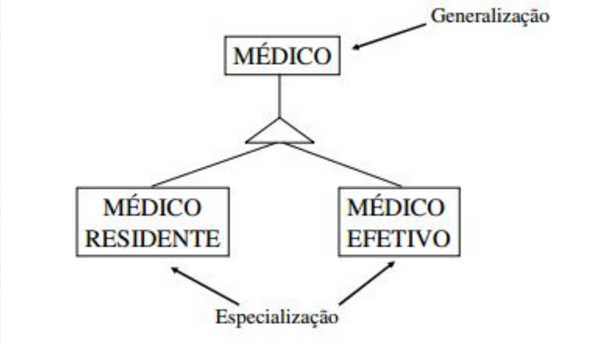
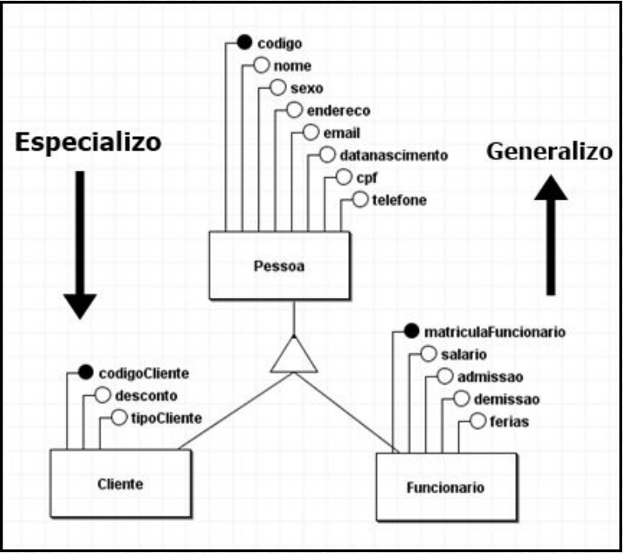

# Modelagem Conceitual

**Conceito de Abstração é um processo mental** que usamos quando selecionamos (ou isolamos) várias características e propriedades de **um conjunto de objetos** ou fatos e **excluímos outras que não são relevantes** ou com as quais não interessa trabalhar no momento.

---

# Abstração

Olhamos uma bicicleta, vemos o resultado de um processo de abstração em que foram excluídos detalhes da estrutura de uma bicicleta, como os pedais, os freios, os mecanismos de tração e, inclusive, as possíveis diferenças entre várias bicicletas.

## Tipo de abstração

### Generalização

Quando definimos um subconjunto de relacionamentos entre elementos de duas ou mais classes. Exemplo: A classe veículo é a generalização da classe bicicleta, pois toda bicicleta é um veículo. Logo, veículo é uma generalização da classe de objetos bicicleta.

Envolve a criação de uma entidade (ou conceito) mais genérica a partir de entidades (ou conceitos) mais específicos. Ela é usada para identificar atributos ou comportamentos comuns entre diferentes entidades e agrupá-los em uma entidade mais abstrata.

### Especialização

A especialização é o processo oposto à generalização. Envolve a identificação de entidades mais específicas que são derivadas de um entidade mais genérica.

# Generalização e Especialização

- Médico <- Cardiologista, Neurologista, Pediatra, Clínico Geral

