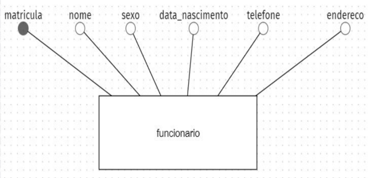
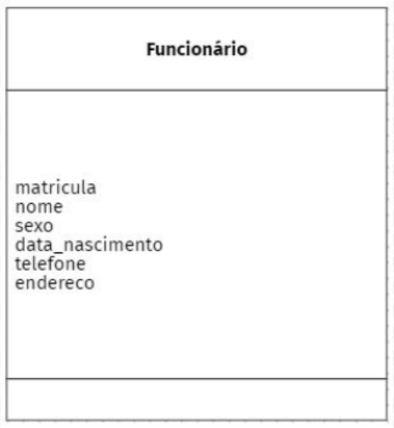
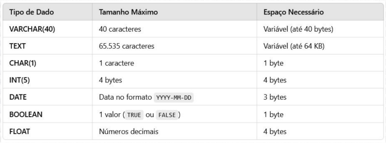

# MER

---

# DER

---

# Modelo Físico

O modelo físico é construído a partir do modelo lógico. Nessa fase do projeto de Banco de Dados passa a ter existência própria.

---

## Tipos de dados

Exemplo

CREATE DATABASE empresa;

CREATE TABLE funcionario (
matricula INT(20) PRIMARY KEY
AUTO_INCREMENT,
nome VARCHAR(45),
sexo CHAR(1),
data_nascimento DATE,
telefone ?????,
endereco ?????,
);

---

# Banco de Dados

**SGBD:** (MySQL, Oracle, MSSql, PostgreSQL)

**SQL:** (Linguagem de Consulta Estruturada)

---

# Comandos DDL

## DDL

Linguagem de definição de dados.

**DDL: CREATE, ALTER e DROP**

**CREATE DATABSE** floricultura

**CREATE TABLE** cliente (...)

**ALTER TABLE** cliente

**DROP TABLE** cliente

## DML

Linguagem de manipulação de dados.

**DML: INSERT, UPDATE e DELETE**

**INSERT INTO** cliente (nome, sexo)
**VALUES** ("Amaro", "M")

**UPDATE** cliente SET nome = "Amaro da Silva"
**WHERE idCLiente = 1**

**DELETE FROM** cliente **WHERE idCLiente = 1**

## DQL

Linguagem de consulta de dados.

**DQL: SELECT**

**SELECT** colunas
**FROM** tabelas

**Exemplo 1:**

> SELECT nome, sexo
> FROM cliente

**DQL: SELECT (Com filtro)**

**SELECT** colunas
**FROM** tabelas
**WHERE** colunas = critério

**Exemplo 2:**

> SELECT nome
> FROM cliente
> WHERE sexo = "M"

**SELECT - JUNÇÃO**

SELECT tabela1.coluna, tabela2.coluna
FROM tabela1
INNER JOIN tabela2
ON tabela1.chaveprimária = tabela2.chaveestrangeira

**DQL - SELECT - JUNÇÃO**

**Exemplo:**

> SELECT cliente.nome, pedido.valor_compra
> FROM cliente
> INNER JOIN pedido
> ON cliente.idCLiente = pedido.idCLiente
