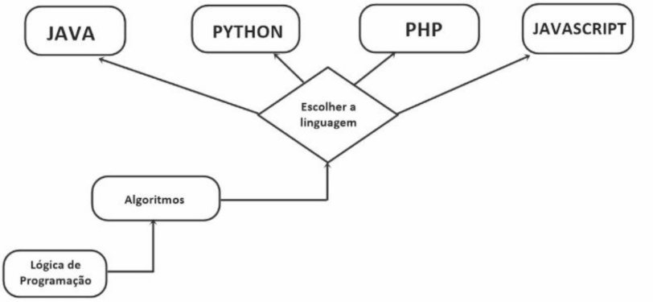
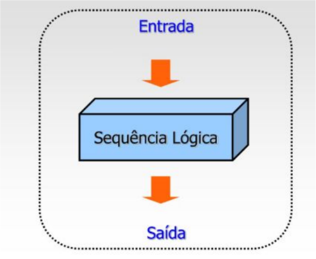
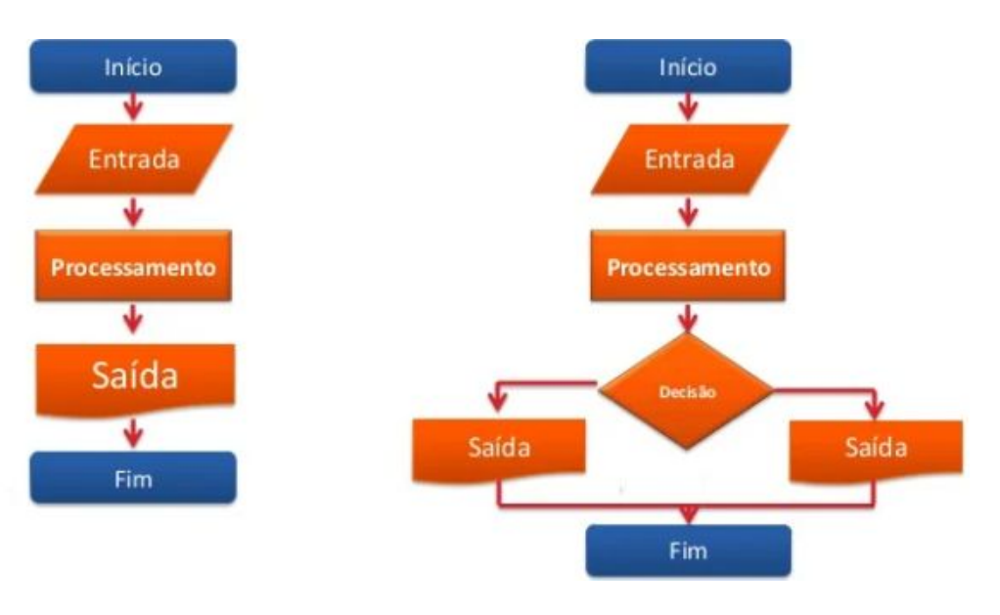
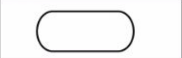
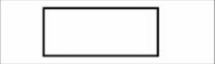
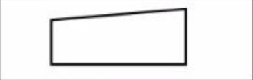

# O que é Lógica de Programação?

Lógica de programação é o **conjunto de regras e técnicas** usadas para desenvolver **algoritmos** e resolver problemas computacionais de forma **estruturada e eficiente**.

- Essencial para qualquer linguagem de programação
- Base para a construção de programas de computador
- Linguagem de programação X linguagem de marcação

---

# Conceito de ENTRADA, SAÍDA e PROCESSAMENTO!

**Entrada:** Dados ou informações fornecidos ao sistema.

**Processamento:** Manipulação e transformação dos dados de entrada. Envolve cálculos, comparações, tomadas de decisões e operações lógicas.

**Saída:** Resultado gerado após o processamento. Pode ser exibido na tela, salvo em um arquivo, enviado para outro sistema, etc.

---

# Fluxogramas

### Representação gráfica de um algoritmo

### Simbologia

| Símbolo                                                                  |       Descrição        | Função                                                            |            Exemplo            |
| :----------------------------------------------------------------------- | :--------------------: | :---------------------------------------------------------------- | :---------------------------: |
|                   |        Terminal        | Símbolo que indica o início ou o fim de um processamento.         |      Início do algoritmo      |
|         |     Processamento      | Símbolo de processamento em geral.                                |    Cálculo de dois números    |
|  | Entrada de dado manual | Símbolo que indica a entrada de dados através do teclado.         |   Digitar a nota da prova 1   |
|                       |         Exibir         | Símbolo que mostra informações ou exibe resultados.               | Mostre o resultado do cálculo |
|                   |        Conectar        | Símbolo utilizado para conectar duas partes do diagrama de bloco. |
|                   |        Comparar        | Símbolo utilizado para comparação entre expressões.               |   Código <= 1000 (Sim/Não)    |
