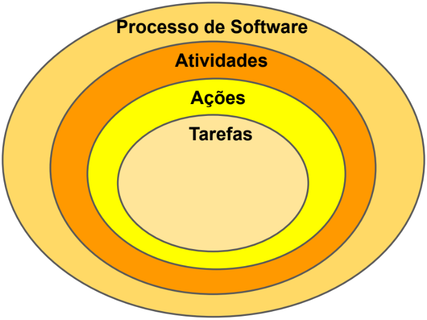

# Tecnologia em Camadas

> - "A base da Engenharia de Software é a camada de processos. O processo de engenharia de software é a liga que mantém as camadas de tecnologia coesas e possibilita o desenvolvimento de software de forma racional e dentro do prazo."

_PRESSMAN 9ª (Edição 2021)_

## Camadas

### 1. Qualidade

Aperfeiçoamento contínuo dos processos.

- Qualidade do Produto
- Qualidade do Processo
- Qualidade de Gestão

### 2. Processos

Interliga camadas de tecnologia e do controle do gerenciamento de projetos.

- Quem está fazendo a atividade?
- Quando essa atividade foi ou será feita?
- Estabelece o contexto para que sejam aplicados:
  - Métodos técnicos
  - Produção de artefatos (modelos, documentos, dados, relatórios, formulários, etc.)

**Observação:** O processo define a metodologia e constitui a base para o controle do gerenciamento e desenvolvimento do software.

### 3. Métodos

Fornecem as informações técnicas para desenvolver o software.

- Instruções de trabalho
- Conjuntos de tarefas com técnicas particulares para cada fase do desenvolvimento de software
- Os métodos envolvem uma ampla variedade de tarefas, que incluem:
  - Comunicação
  - Análise de requisitos
  - Modelagem de projeto
  - Construção de programa
  - Testes
  - Suporte

### 4. Ferramentas

Fornecem suporte para o processo e para os métodos.

- Meios automatizados ou semi-automatizados
- Quando as ferramentas são integradas, de modo que as informações criadas por uma ferramenta possam ser utilizadas por outra, é estabelecido um sistema para o suporte ao desenvolvimento de software, denominado engenharia de software com o auxílio do computador (Ferramentas CASE — Computer-Aided Software Engineering)

---

# O Processo do Software

- Não é uma prescrição rígida de como desenvolver um software
- É uma abordagem adaptável que possibilita às pessoas realizarem o trabalho de selecionar e escolher o conjunto apropriado de ações e tarefas
- A intenção é a de sempre entregar o software dentro do prazo e com qualidade suficiente para satisfazer aqueles que patrocinaram sua criação e aqueles que vão utilizá-lo

> - "É um conjunto de **atividades**, **ações** e **tarefas** realizadas na criação de algum artefato."

_PRESSMAN 9ª (Edição 2021)_

**Atividades:** Esforço para atingir um objetivo amplo.

**Ações:** Envolve um conjunto de tarefas que resultam em um artefato de software fundamental.

**Tarefas:** Se concentra em um objetivo pequeno, porém bem definido e produz um resultado tangível.

## A Metodologia

### 1. Princípio da Comunicação

- Antes que qualquer trabalho técnico possa começar é de importância fundamental se comunicar e colaborar com os stakeholders
- A intenção é entender os objetivos dos envolvidos para projeto e reunir requisitos que ajudem a unir os recursos e as funções do software

### 2. Princípio do Planejamento

- Qualquer jornada complicada pode ser simplificada com o auxílio de um mapa
  - Um mapa define o trabalho de Engenharia de Software
  - Define as tarefas técnicas, os riscos, os recursos, os artefatos que serão produzidos e o cronograma

### 3. Princípio da Modelagem

- Cria-se um "esboço" para que se possa ter uma idea do todo
- Apresenta como as partes constituintes se encaixarão, em termos de arquitetura
- Um engenheiro de software cria modelos para entender melhor as necessidades do software e o projeto que vai atender a essas necessidades

### 4. Princípio da Construção

- O que se projeta deve ser construído
- Combina geração de código (manual ou automatizada) e testes necessários para revelar erros na codificação

### 5. Princípio da Entrega

- O software é entregue ao cliente, que avalia o produto e fornece feedback, baseado na avaliação

---

# A Essência da Prática

1. Compreender o problema (comunicação e análise)
2. Planejar uma solução (modelagem e projeto de software)
3. Executar o plano (geração de código)
4. Examinar os resultados para ter precisão (testes e garantia da qualidade)

---

# Como tudo começa?

> - "Todo projeto de software é motivado por alguma necessidade de negócios — a necessidade de corrigir um defeito em uma aplicação existente; a necessidade de adaptar um "sistema legado" a um ambiente de negócios em constante transformação; a necessidade de ampliar as funções e os recursos de uma aplicação existente; ou a necessidade de criar um novo produto, serviço ou sistema."

_PRESSMAN 9ª (Edição 2021)_
