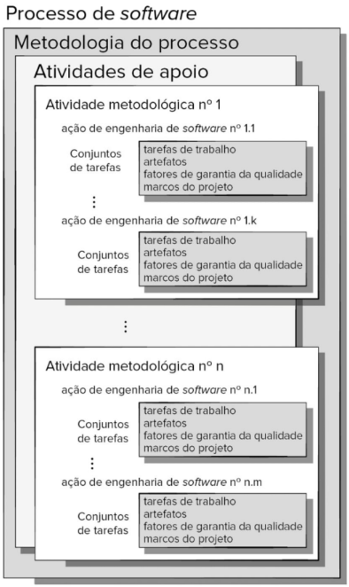
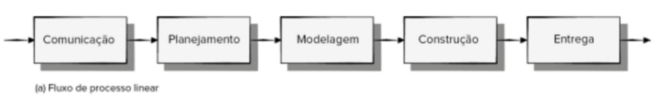
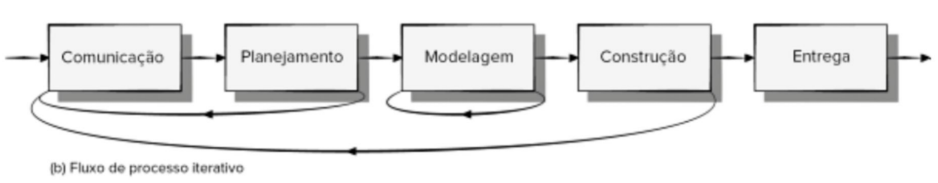
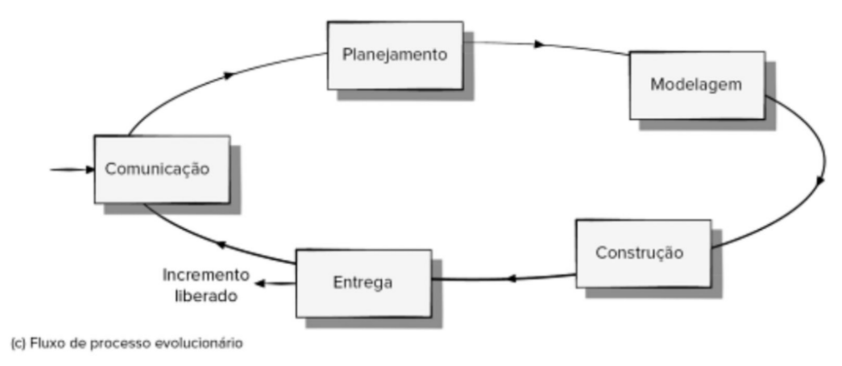
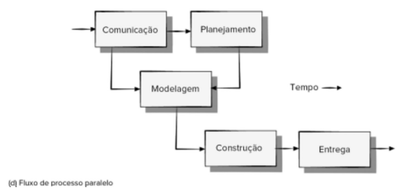
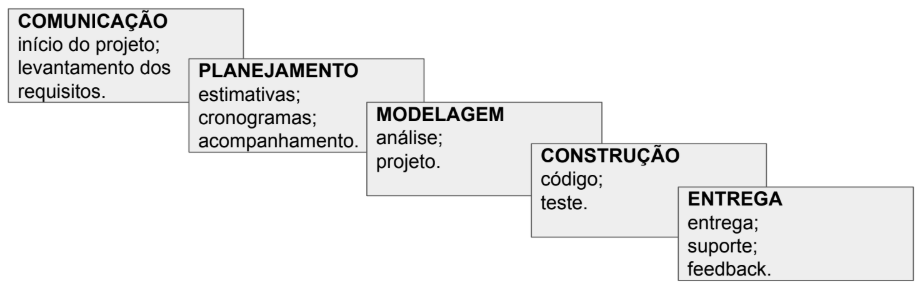
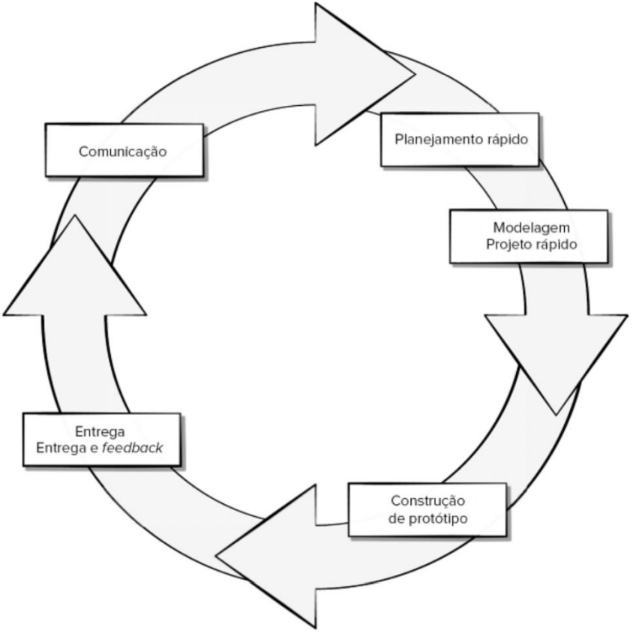
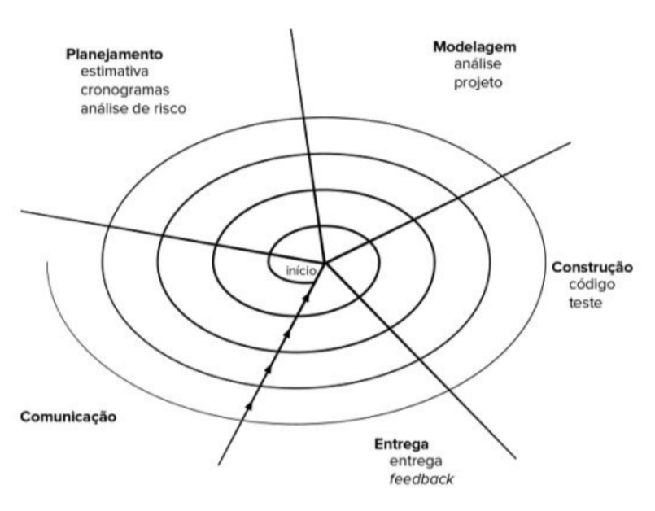
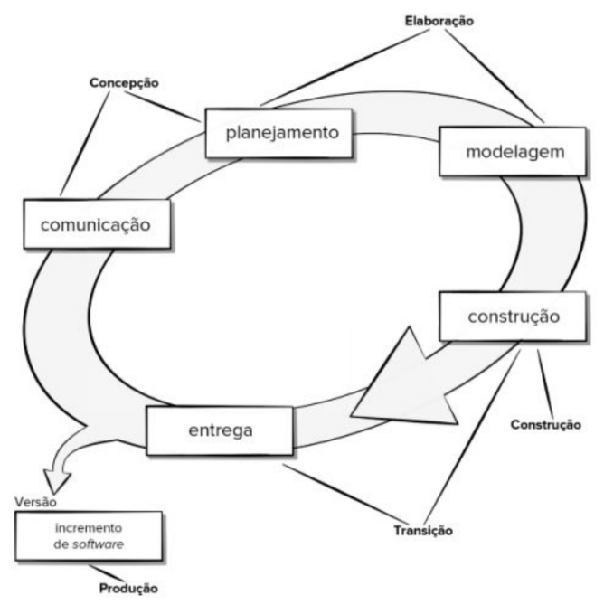

# Modelos de Processo

Relembrando...

> "O processo foi definido como um conjunto de **atividades** de trabalho, **ações** e **tarefas** realizadas quando algum artefato de software deve ser criado".

_PRESSMAN 9ª (Edição 2021)_

## Um Modelo de Processo Genérico

Cada uma dessas atividades, ações e tarefas se aloca dentro de uma metodologia ou modelo que determina sua relação com o processo e uma com a outra.

_PRESSMAN 9ª (Edição 2021)_

Um aspecto importante do processo de software é chamado de **fluxo de processo** — descreve como são organizadas as atividades metodológicas, bem como as ações e tarefas que ocorrem dentro de cada atividade em relação à sequência e ao tempo.

### Fluxo de Processo Linear

Executa cada uma das cinco atividades metodológicas em sequência, começando com a comunicação e culminando com a entrega.

### Fluxo de Processo Interativo

Um fluxo de processo iterativo repete uma ou mais das atividades antes de prosseguir para a seguinte.

### Fluxo de Processo Evolucionário

Um fluxo de processo evolucionário executa as atividades de forma "circular". Cada volta pelas cinco atividades conduz a uma versão mais completa do software.

### Fluxo de Processo Paralelo

Executa uma ou mais atividades em paralelo com outras.

---

# Definição de Uma Atividade Metodológica

Quais ações são apropriadas para uma atividade metodológica, uma vez fornecidos a natureza do problema a ser solucionado, as características das pessoas que farão o trabalho e os envolvidos no projeto?

Para um pequeno projeto de software solicitado por uma única pessoa (em um local distante) com requisitos simples e objetivos, a atividade de comunicação pode se resumir a pouco mais de um telefonema ou e-mail para o envolvido.

1. Contatar o envolvido via telefone.
2. Discutir os requisitos e gerar anotações.
3. Organizar as anotações em uma breve relação de requisitos, por escrito.
4. Enviar um e-mail para o envolvido para revisão e aprovação.

Se o projeto fosse consideravelmente mais complexo, com muitos envolvidos, cada qual com um conjunto de requisitos diferentes (por vezes conflitantes), a atividade de comunicação poderia ter seis ações distintas: **concepção, levantamento, elaboração, negociação, especificação e validação**.

Cada uma dessas ações de engenharia de software contém muitas tarefas de trabalho e uma série de diferentes artefatos.

---

# Identificação de um conjunto de tarefas

Cada ação de engenharia de software pode ser representada por vários e diferentes conjuntos de tarefas — constituídos por uma gama de tarefas de trabalho de engenharia de software, artefatos relacionados, fatores de garantia da qualidade e marcos do projeto.

**Nota:** Projetos diferentes exigem conjuntos de tarefas diferentes.

Deve-se escolher um conjunto de tarefas mais adequado às necessidades do projeto e às características da equipe.

Isso significa que uma ação de engenharia de software pode ser adaptada às necessidades específicas do projeto de software e às características da equipe.

## Conjuntos de tarefas

Um conjunto de tarefas define o trabalho a ser feito para atingir os objetivos de uma ação de engenharia de software. Por exemplo, levantamento (mais comumente denominado "levantamento de requisitos") é uma importante ação de engenharia de software que ocorre durante a atividade de **comunicação**. A meta do levantamento de requisitos é compreender o que os vários envolvidos esperam do software a ser desenvolvido.

### Projeto Simples

Para um projeto pequeno e relativamente simples, o conjunto de tarefas para levantamento dos requisitos seria semelhante a este:

> 1. Fazer uma lista dos envolvidos no projeto.
> 2. Fazer uma reunião informal com todos os envolvidos.
> 3. Solicitar a cada envolvido uma lista com as características e funções necessárias.
> 4. Discutir sobre os requisitos e elaborar uma lista final.
> 5. Organizar os requisitos por grau de prioridade.
> 6. Destacar pontos de incertezas.

### Projeto Complexo

Para um projeto de software maior e mais complexo, é preciso usar um conjunto diferente de tarefas. Esse conjunto pode incluir as seguintes tarefas de trabalho:

> 1. Fazer uma lista dos envolvidos no projeto.
> 2. Entrevistar separadamente cada um dos envolvidos para levantamento geral de suas expectativas e necessidades.
> 3. Fazer uma lista preliminar das funções e características, com base nas informações fornecidas pelos envolvidos.
> 4. Agendar uma série de reuniões facilitadoras para especificação de aplicações.
> 5. Realizar reuniões.
> 6. Incluir cenários informais de usuários como parte de cada reunião.
> 7. Refinar os cenários de usuários, com base no feedback dos envolvidos.
> 8. Fazer uma lista revisada dos requisitos dos envolvidos.
> 9. Empregar técnicas de implantação de funções de qualidade para estabelecer graus de prioridade dos requisitos.
> 10. Agrupar os requisitos de modo que possam ser entregues em incrementos.
> 11. Fazer um levantamento das limitações e restrições que serão aplicadas ao sistema.
> 12. Discutir sobre os métodos para validação do sistema.

Esses dois conjuntos de tarefas atingem o objetivo do "levantamento de requisitos"; porém, são bem diferentes quanto ao seu grau de profundidade e formalidade. A equipe de software deve escolher o conjunto de tarefas que possibilite atingir o objetivo de cada ação, mantendo, inclusive, a qualidade e a agilidade.

Deve-se escolher um conjunto de tarefas mais adequado às necessidades do projeto e às características da equipe.

Isso significa que uma ação de engenharia de software pode ser adaptada às necessidades específicas do projeto de software e às características da equipe.

---

# Avaliação de Aperfeiçoamento de Processo

A existência de um processo de software não garante que o software será entregue dentro do prazo, que estará de acordo com as necessidades do cliente ou que apresentará características técnicas que resultarão em qualidade em longo prazo.

Os processos e as atividades de software devem ser avaliados utilizando medidas numéricas ou análise de software (métricas).

O seu progresso na jornada em direção a um processo de software eficaz definirá o quanto você consegue mensurar a melhoria de forma significativa.

## Modelos de Processo Prescritivo

Os modelos de processo prescritivo definem um conjunto prescrito de elementos de processo e um fluxo de trabalho de processo previsível.

Um modelo de processo prescritivo concentra-se em estruturar e ordenar o desenvolvimento de software. As atividades e tarefas ocorrem sequencialmente, com diretrizes de progresso definidas.

Chamamos esses processos de "prescritivos" porque prescrevem um conjunto de elementos de processo — atividades metodológicas, ações de engenharia de software, tarefas, artefatos, garantia da qualidade e mecanismos de controle de mudanças para cada projeto.

Cada modelo de processo também prescreve um fluxo de processo (também denominado fluxo de trabalho) — ou seja, a forma pela qual os elementos do processo estão relacionados.

## Modelo Cascata

O modelo cascata, algumas vezes chamado de modelo sequencial linear, sugere uma abordagem sequencial e sistemática para o desenvolvimento de software, começando com a especificação dos requisitos do cliente, avançando pelas fases de planejamento, modelagem, construção e entrega, e culminando no suporte contínuo do software.

**Críticas:**

1. Projetos reais raramente seguem o fluxo sequencial proposto pelo modelo.
2. Com frequência, é difícil para o cliente estabelecer explicitamente todas as necessidades no início da maioria dos projetos.
3. O cliente deve ter paciência. Uma versão operacional do(s) programa(s) não estará disponível antes de estarmos próximos ao final do projeto.
4. Erros graves podem não ser detectados até o programa operacional ser revisto.

## Modelo de Processo de Prototipação

Embora a prototipação possa ser utilizada como um modelo de processo isolado (stand-alone process), ela é mais comumente utilizada como uma técnica a ser implementada no contexto de qualquer um dos modelos de processo.

Independentemente da forma como é aplicado, quando os requisitos estão obscuros, o paradigma da prototipação auxilia os envolvidos a compreender melhor o que está para ser construído.

1. **Comunicação:** Faz-se uma reunião com os envolvidos para definir os objetivos gerais do software, identicar os requisitos já conhecidos e esquematizar quais áreas necessitam, obrigatoriamente, de uma definição mais ampla.

2. **Planejamento Rápido:** Uma iteração de prototipação é planejada rapidamente e ocorre a modelagem (na forma de um "projeto rápido").

3. **Modelagem/Projeto Rápido:** Se concentra em uma representação dos aspectos do software que serão visíveis para os usuários.

4. **Construção de Protótipo:** O projeto rápido leva à construção de um protótipo.

5. **Entrega:** O protótipo é entregue e avaliado pelos envolvidos, os quais fornecem feedback que é usado para refinar ainda mais os requisitos.

- Na sua forma ideal, o protótipo atua como um mecanismo para identificar os requisitos do software;

- Tanto os envolvidos quanto os engenheiros de software gostam do paradigma da prototipação:
  1. Os usuários podem ter uma ideia prévia do sistema final;
  2. 0s desenvolvedores passam a desenvolver algo imediatamente.

**Críticas:**

1. Os envolvidos enxergam o que parece ser uma versão operacional do software. Eles podem desconhecer que a arquitetura do protótipo (a estrutura do programa) também está evoluindo. Isso significa que os desenvolvedores podem não ter considerado a qualidade global do software, nem sua manutenção em longo prazo.

2. O engenheiro de software pode ficar tentado a fazer concessões na implementação para conseguir que o protótipo entre em operação rapidamente. Se não tomar cuidado, essas escolhas longe de ideais acabam se tornando uma parte fundamental do sistema.

## Modelo de Processo de Evolucionário

Como todos os sistemas complexos, o software evolui ao longo do tempo. Conforme o desenvolvimento do projeto avança, os requisitos do negócio e do produto frequentemente mudam, tornando inadequado seguir um planejamento em linha reta de um produto final.

Prazos apertados tornam impossível concluir um produto de software abrangente. Pode ser possível criar uma versão limitada do produto para atender às pressões comerciais ou da concorrência e lançar uma versão refinada após um melhor entendimento de todas as características do sistema.

Em situações como essa, faz-se necessário um modelo de processo que tenha sido projetado especificamente para desenvolver um produto que cresce e muda.

### Modelo Espiral

É um modelo de processo de software evolucionário que une a natureza iterativa da prototipação aos aspectos sistemáticos e controlados do modelo cascata. Tem potencial para o rápido desenvolvimento de versões cada vez mais completas do software.

Com o modelo espiral, o software será desenvolvido em uma série de versões evolucionárias. Nas primeiras iterações, a versão pode consistir em um modelo ou em um protótipo. Já nas iterações posteriores, são produzidas versões cada vez mais completas do sistema que passa pelo processo de engenharia.

- O modelo espiral é dividido em um conjunto de atividades metodológicas definidas pela equipe de engenharia de software;
- Cada uma dessas atividades representa um segmento do caminho espiral.

Assim que esse processo evolucionário começa, a equipe de software realiza atividades indicadas por um circuito em torno da espiral, no sentido horário, começando pelo seu centro.

O primeiro circuito em volta da espiral iniciando na linha de fluxo interna mais próxima ao centro pode resultar no desenvolvimento de uma especificação de produto.

Passagens subsequentes em torno da espiral podem ser usadas para desenvolver um protótipo e, então, progressivamente, versões cada vez mais sofisticadas do software.

- Cada passagem pela região de planejamento resulta em ajustes no planejamento do projeto.
- Custo e cronograma são ajustados de acordo com o feedback (a realimentação) obtido do cliente após a entrega.
- O gerente de projeto faz um ajuste no número de iterações planejadas para concluir o software.

Diferentemente de outros modelos de processo, que terminam quando o software é entregue, o modelo espiral pode ser adaptado para ser aplicado ao longo da vida do software.

O modelo espiral é uma abordagem realista para o desenvolvimento de sistemas e de software em larga escala. Ele usa a prototipação como mecanismo de redução de riscos.

O modelo espiral exige consideração direta dos riscos técnicos em todos os estágios do projeto e, se aplicado apropriadamente, reduz os riscos antes destes se tornarem problemáticos.

Pode ser difícil convencer os clientes (particularmente em situações contratuais) de que a abordagem evolucionária é controlável. Ela exige considerável especialização na avaliação de riscos e depende dessa especialização para seu sucesso. Se um risco muito importante não for descoberto e administrado, sem dúvida ocorrerão problemas.

O software moderno é caracterizado por contínuas modificações, prazos muito apertados e por uma ênfase na satisfação do cliente-usuário. Em muitos casos, o tempo de colocação de um produto no mercado é o requisito mais importante a ser gerenciado. Se o momento oportuno de entrada no mercado for perdido, o projeto de software pode perder o sentido.

O objetivo dos modelos evolucionários é desenvolver software de alta qualidade de modo iterativo ou incremental. Entretanto, é possível usar um processo evolucionário para enfatizar a exibilidade, a extensibilidade e a velocidade de desenvolvimento.

O desafio para as equipes de software e seus gerentes será estabelecer um equilíbrio apropriado entre esses parâmetros críticos de projeto e produto e a satisfação dos clientes (o árbitro final da qualidade de um software).

## Modelo de Processo Unificado

É uma tentativa de aproveitar os melhores recursos e características dos modelos tradicionais de processo de software, mas caracterizando-os de modo a implementar muitos dos melhores princípios do desenvolvimento ágil de software.

O Processo Unificado reconhece a importância da comunicação com o cliente e de métodos racionalizados para descrever a visão do cliente sobre um sistema (os casos de uso).

Ele enfatiza o importante papel da arquitetura de software e "ajuda o arquiteto a manter o foco nas metas corretas, como compreensibilidade, confiança em mudanças futuras e reutilização"

Ele sugere um fluxo de processo iterativo e incremental, proporcionando a sensação evolucionária que é essencial no desenvolvimento de software moderno.

A **UML (unified modeling language)**, a linguagem de modelagem unificada, foi desenvolvida para apoiar o seu trabalho, contém uma notação robusta para a modelagem e o desenvolvimento de sistemas orientados a objetos e tornou-se um padrão da indústria para o desenvolvimento de software de todos os tipos.

A figura a seguir representa as “fases” do Processo Unificado e relaciona-as às atividades genéricas:

### Concepção

Nesta fase do PU ocorre a **comunicação** com o cliente e o **planejamento**. Requisitos de negócio fundamentais são descritos em um conjunto de casos de uso preliminares descrevendo quais recursos e funções são esperados na arquitetura de software por cada categoria principal de usuário.

O **planejamento** identifica recursos, avalia os principais riscos e define um
cronograma preliminar para os incrementos de software.

### Elaboração

Esta fase do PU inclui as atividades de **planejamento** e **modelagem** do modelo de processo genérico. Normalmente, as modificações no planejamento são feitas nesta fase.

### Construção

A fase de **construção** do PU é idêntica à atividade de construção definida para o processo de software genérico. Implementam-se, então, no código-fonte, todos os recursos e funções necessários e exigidos para o incremento de software (i.e., para a versão). À medida que os componentes são implementados, desenvolvem-se e executam-se testes de unidade para cada um deles.

### Transição

A fase de transição do PU abrange os últimos estágios da atividade de **construção** genérica e a primeira parte da atividade de emprego genérico: **entrega** e feedback. Entrega-se o software aos usuários para testes beta, e o feedback dos usuários relata defeitos e mudanças necessárias. Na conclusão da fase de transição, o incremento torna-se uma versão utilizável do software.

### Produção

A fase de produção do PU coincide com a atividade de **entrega** do processo genérico. Durante esta fase, monitora-se o uso contínuo do software, disponibiliza-se suporte para o ambiente (infraestrutura) operacional, realizam-se e avaliam-se relatórios de defeitos e solicitações de mudanças.

É provável que, ao mesmo tempo em que as fases de construção, transição e produção estejam sendo conduzidas, já se tenha iniciado o incremento de software seguinte. Isso significa que as cinco fases do PU não ocorrem em sequência, mas de forma concomitante e escalonada.

Deve-se observar que nem toda tarefa identificada para um fluxo de trabalho do PU é conduzida em todos os projetos de software. A equipe adapta o processo (ações, tarefas, subtarefas e artefatos) para ficar de acordo com suas necessidades.

### Comparação entre modelos de processos

#### Modelo Cascata

- **Prós do modelo cascata:** É fácil de entender e planejar. Funciona para projetos pequenos e bem compreendidos. A análise e o teste são simples e diretos.

- **Contras do modelo cascata:** Não se adapta bem a mudanças. O teste ocorre nas fases finais do processo. A aprovação do cliente vem no final.

#### Modelo de Processo de Prototipação

- **Prós da prototipação:** O impacto das alterações aos requisitos é reduzido. O cliente se envolve bastante e desde o início. Funciona bem para projetos pequenos. A probabilidade de rejeição do produto é reduzida.

- **Contras da prototipação:** O envolvimento do cliente pode causar atrasos. Pode haver a tentação de “embalar” o protótipo. Desperdiça-se trabalho em um protótipo descartável. É difícil de planejar e gerenciar.

#### Modelo Espiral

- **Prós do modelo espiral:** Há envolvimento contínuo dos clientes. Os riscos de desenvolvimento são gerenciados. É apropriado para modelos grandes e complexos. Funciona bem para artefatos extensíveis.

- **Contras do modelo espiral:** Falhas de análise de risco podem fadar o projeto ao fracasso. O projeto pode ser difícil de gerenciar. Exige uma equipe de desenvolvimento especializada.

#### Modelo Processo Unificado

- **Prós do Processo Unificado:** A documentação de alta qualidade é enfatizada. Há envolvimento contínuo dos clientes. Adapta-se a alterações aos requisitos. Funciona bem para projetos de manutenção.
-
- **Contras do Processo Unificado:** Os casos de uso nem sempre são precisos. A integração de incrementos de software é complicada. A sobreposição das fases pode causar problemas. Exige uma equipe de desenvolvimento especializada.
