# Redes de Dados

## Início

- As redes foram desenvolvidas devido às aplicações empresariais para microcomputadores.

- Os microcomputadores não eram conectados da mesma maneira que os **thin clients** no **mainframe**, não havendo uma maneira eficiente de compartilhar dados entre eles.

> As companhias investiram em computadores como dispositivos autônomos que às vezes vinham acompanhados de impressoras. Quando os empregados que não tinham impressoras queriam imprimir documentos, tinham que copiar seus arquivos em disquetes, levá-los até seu colega de trabalho e carregá-lo no seu PC e então fazer a impressão a partir daquele PC. Esta versão bastante rústica de rede tornou-se conhecida como **"Sneakernet"**.

- O compartilhamento de dados usando **disquetes** não era uma maneira eficiente e econômica de se administrar empresas:
  - Como **evitar a duplicação** de equipamentos e recursos?
  - Como se **comunicar eficazmente**?
  - Como **configurar e gerenciar** uma rede?

**Observações:**

- **thin clients:** É um computador cliente em uma rede de modelo cliente-servidor de duas camadas o qual tem poucos ou nenhum aplicativo instalados, de modo que depende primariamente de um servidor central para o processamento de atividades.

- **mainframe:** Um mainframe é um computador de grande porte dedicado normalmente ao processamento de um volume enorme de informações. O termo "mainframe" era utilizado para se referir ao gabinete principal que alojava a unidade central de processamento nos primeiros computadores.
- **disquetes:** O disquete é um dispositivo de armazenamento magnético que foi muito utilizado em computadores nas décadas de 1980 e 1990. Hoje, é considerado obsoleto e foi substituído por dispositivos como pen drives e cartões de memória.

No início dos anos 80, as tecnologias de rede que surgiram tinham sido criadas usando diferentes implementações de hardware e software. Devido à competição, cada empresa que criava hardware e software para redes, usava seus próprios padrões. Consequentemente, muitas das novas tecnologias de rede eram incompatíveis umas com as outras. Frequentemente, era necessário que o equipamento antigo de rede fosse removido para que fosse implementado o novo equipamento. Uma das primeiras soluções foi a criação de padrões de **redes locais (LAN)**.

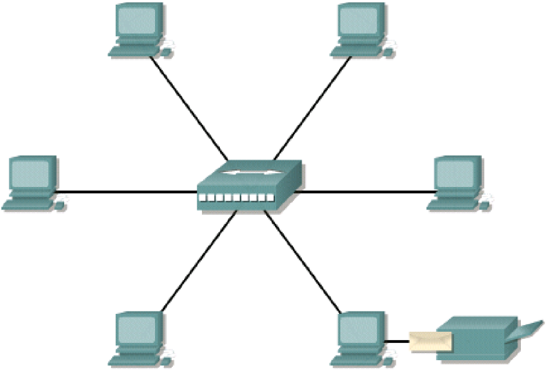

**Exemplo: Topografia Estrela**

À medida que o uso do computador nas empresas cresceu, logo percebeu-se que as **LANs** não eram mais suficientes. Era necessário um modo de mover informações de maneira rápida e eficiente, não só dentro da empresa, mas também de uma empresa para outra. A solução foi a criação de outros tipos de redes.

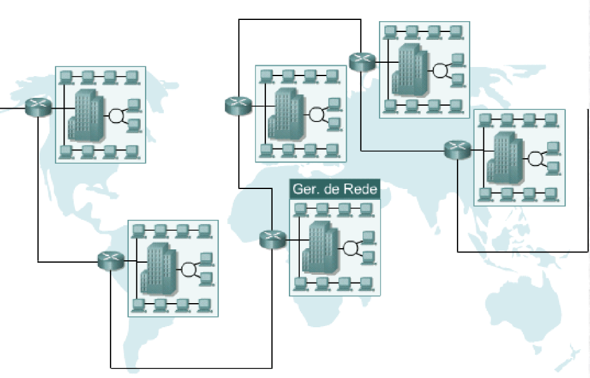

## Classificação das Redes

|   Sigla    |           Nome            |     Distância     |       Contexto        | Descrição                                                                                                                                                                                                                                                                                                                                                                             |
| :--------: | :-----------------------: | :---------------: | :-------------------: | :------------------------------------------------------------------------------------------------------------------------------------------------------------------------------------------------------------------------------------------------------------------------------------------------------------------------------------------------------------------------------------ |
| PAN / WPAN |   Personal Area Network   |       1 m²        | Entorno de uma pessoa | Nesse tipo de rede sua distância é, no máximo, de algumas dezenas de metros (sem barreiras físicas, como paredes, etc), podemos citar, como exemplo da rede PAN, a rede Bluetooth.                                                                                                                                                                                                    |
| LAN / WLAN |    Local Area Network     | 10 m, 100 m, 1 km |        Campus         | Podemos defini-la como uma rede que está em uma região pequena, que pode chegar a algumas centenas de metros, mas que se reduz para bem menos. Se houver barreiras físicas (paredes, etc), haverá uma interconexão de equipamentos de comunicação de dados. Algumas características das redes locais são altas taxas de transmissão e baixas taxas de erro e são propriedade privada. |
| MAN / WMAN | Metropolitan Area Network |       10 km       |        Cidade         | São redes que ocupam o perímetro de um bairro ou uma cidade. Permitem que empresas com filiais em bairros diferentes se comuniquem.                                                                                                                                                                                                                                                   |
| WAN / WWAN |     Wide Area Network     |  100 km, 1000 km  |  País ou Continente   | São redes usadas para fazer o compartilhamento de recursos para usuários que estão geograficamente distribuídos. São redes com um custo elevado, pois utilizam circuitos para satélites e enlaces de micro-ondas.                                                                                                                                                                     |

**Observação:** A letra **"W"** no início representa a palavra **Wireless**, indicando que se trata de redes sem fio.

---

# Conectividade

A **placa de rede**, é um dispositivo de hardware responsável pela comunicação entre um computador e uma rede. Essa placa é o hardware que permite aos computadores conversarem entre si através da rede e sua função é **controlar todo o envio e recebimento de dados** através da rede. Cada arquitetura de rede exige um **tipo específico de placa**.

Com a utilização das tecnologias de **redes locais** e **WAN**, vários computadores são interligados para oferecer serviços aos seus usuários. Para realizar isso, os computadores interligados assumem **diferentes papéis ou funções em relação aos outros**. E **independente do tipo de aplicação utilizada na rede**, 2 computadores tipicamente se comunicam usando protocolos de pedido/resposta (request/response). Um computador emite um **pedido** para um serviço e o segundo computador recebe e **responde** àquele pedido. O requisitante assume o papel de um **cliente** e o que responde assume o papel de um **servidor**.

## Tipos de Comunicação

### Ponto-a-Ponto

- Os hosts interconectados agem como **parceiros iguais**, ou pares.

- Cada computador pode assumir a função de **cliente** ou **servidor**.

- São relativamente fáceis de instalar e operar, pois **não é necessário nenhum equipamento adicional**, além de um SO que permita o controle de recursos.

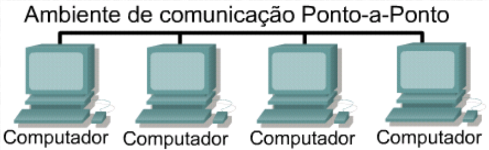

#### Vantagens

- Mais **econômico** para implementar;

- **Não exige software adicional** especializado em administração de redes;

- Não exige um administrador **dedicado** de redes.

#### Desvantagens

- **Não se adapta bem ao crescimento** de grandes redes e a administração se torna mais difícil de ser gerenciada;

- Cada **usuário precisa ser treinado** para realizar tarefas administrativas;

- Menos seguro;

- Todas as máquinas que compartilham os recursos tem o **desempenho** afetado de maneira negativa.

### Cliente/Servidor

- Os serviços de redes estão localizados em um computador dedicado denominado **servidor**.

- O servidor **responde às solicitações de clientes** para arquivos, impressão, aplicativos e outros serviços.

- Os servidores são projetados para processarem **simultaneamente** solicitações de vários clientes.

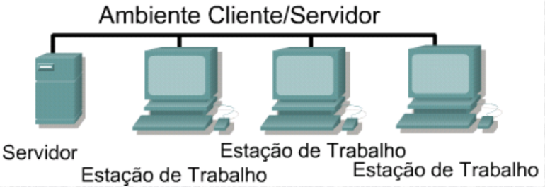

#### Vantagens

- Oferece **maior segurança**;

- É **mais fácil de se administrar** quando a rede é grande pois a administração é centralizada;

- Pode-se fazer **backup dos dados em um local central**.

#### Desvantagens

- Exige **software especializado muito caro** para a operação de a administração de redes;

- Exige **hardware mais caro** e muito mais potente para a máquina do servidor;

- Requer um **administrador profissional**;

- Possui um único ponto de falha. Se o servidor estiver inativo, os dados do usuário não estarão disponíveis.

---

# História das Redes

Em linhas gerais, podemos analisar a história das redes de computadores à partir da seguinte linha do tempo:

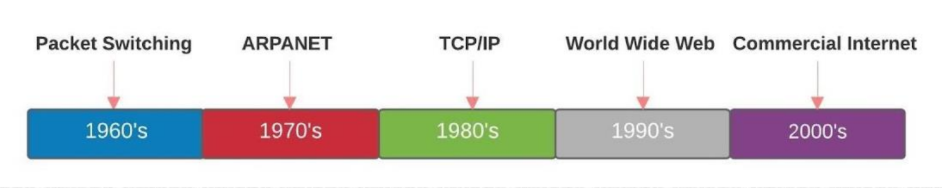

## Comutação de Pacotes

Desenvolvida no início dos anos 1960, foi projetada para substituir a comutação de circuitos. Nessa época, a comunicação ponto a ponto e era muito ineficiente e era necessário estabelecer conexões para todos os pontos envolvidos. A comutação de pacotes eliminou essa complexidade.

## ARPANET

Foi desenvolvida no final dos anos 1970 pela ARPA (Agência de Pesquisa Militar dos Estados Unidos), através de uma colaboração entre computadores de pesquisa militares e universitários. Esse projeto cresceu para centenas de computadores no início dos anos 80 e forneceu o modelo básico para a Internet que usamos hoje.

## TCP/IP

Desenvolvido por 2 cientistas (Robert Kahn e Vint Cerf), usa uma estrutura em camadas lógicas que suportam diferentes meios de transmissão e aplicativos. Tornou-se um padrão de domínio público, sendo a base da comunicação da internet hoje.

## World Wide Web

Tim Berners-Lee inventou a **"WWW"** no período de 1989 a 1990. Também desenvolveu o primeiro servidor da WEB em 1993. O código do projeto foi aberto para a comunidade pública, fornecendo a base para o crescimento dessa tecnologia.

## Internet Comercial

O desenvolvimento de tecnologias, desde a década de 1960, tornaram as redes como conhecemos hoje.

---

# Arquitetura da Internet

- Redes orientadas à conexão de **comutação de circuito**.

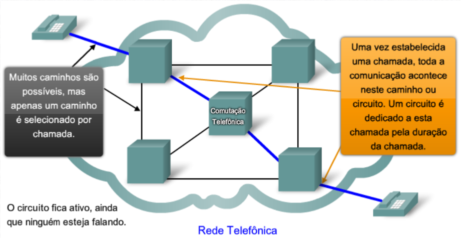

> Apesar de existirem muitos circuitos, eles são finitos. Durante período de pico, algumas chamadas podem ser negadas.

- **Entrega de pacotes** em uma rede de dados

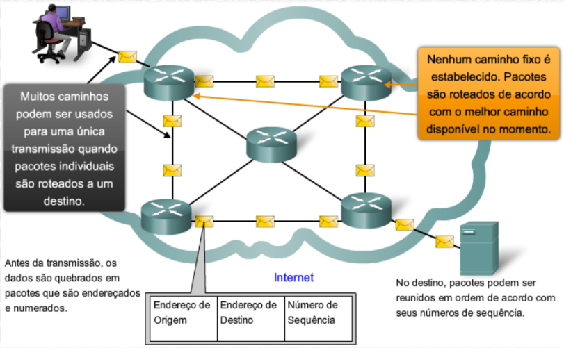

> Durante os períodos de pico, a comunicação pode ser atrasada.

**Exemplo:**

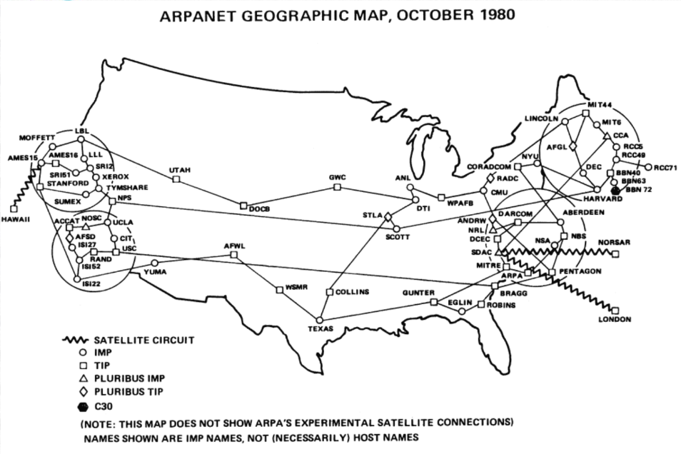

---

# Componentes de Rede

Por padrão, existem símbolos para representar os componentes de rede, podendo ser divididos em duas classificações.

## Dispositivos Finais

Formam a interface entre os usuários e a rede de comunicação.

**Exemplo:**

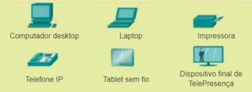

## Dispositivos intermediários

Conectam os hosts individuais à rede e podem conectar várias redes individuais para formar uma rede interconectada.

**Exemplo:**

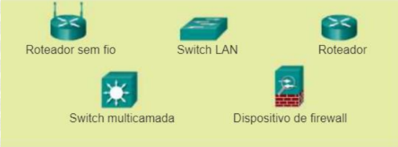

---

# Dispositivos de Rede

## Repetidor

Regeneram os sinais que foram distorcidos por perdas na transmissão devido à atenuação. Não realizam decisões inteligentes sobre o encaminhamento de pacotes como um roteador ou bridge.

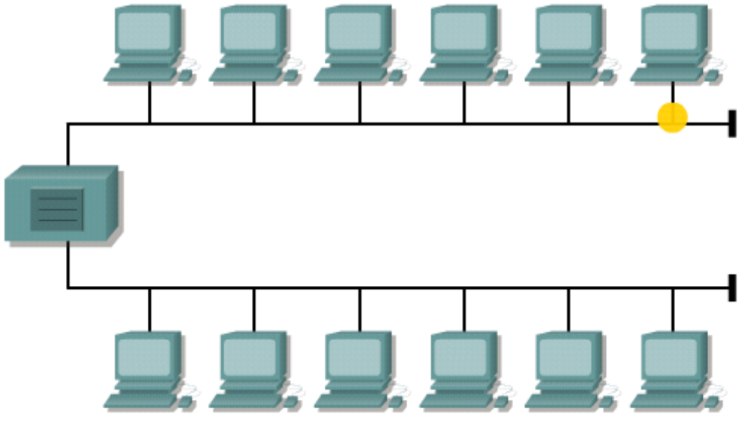

## Hub

Concentram conexões, de modo passivo, sem qualquer outro efeito na transmissão dos dados. Os hubs ativos não só concentram hosts, como também regeneram sinais.

## Bridge

Proporcionam conexões entre redes locais, como também verificam os dados para determinar se devem ou não cruzar a bridge. Isto faz com que cada parte da rede seja mais eficiente.

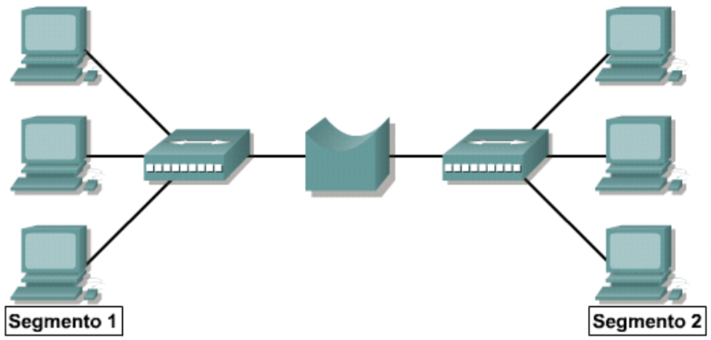

## Switch

Determinam se os dados devem ou não permanecer em uma rede local, mas como também podem transferir os dados somente para a conexão que necessita daqueles dados. Os switches adicionam mais inteligência ao gerenciamento da transferência de dados.

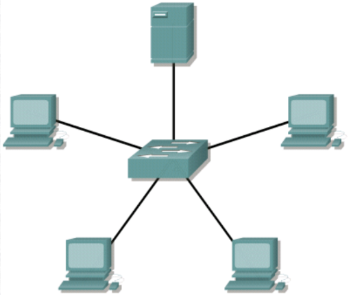

## Roteador

Os roteadores podem regenerar sinais, concentrar conexões múltiplas, e gerenciar as transferências de dados. Eles também podem ser conectados a uma WAN, que lhes permite conectar redes locais que estão separadas por longas distâncias. Nenhum outro dispositivo pode prover este tipo de conexão.

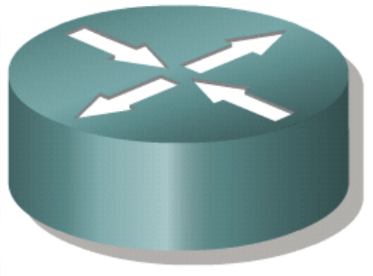

---

# Topologias de Rede

## Topologias Físicas

### Barramento (Bus)

Usa um único cabo backbone que é terminado em ambas as extremidades. Todos os hosts são diretamente conectados a este backbone.

### Anel (Ring)

Conecta um host ao próximo e o último host ao primeiro. Isto cria um anel físico utilizando o cabo.

### Estrela (Star)

Conecta todos os cabos a um ponto central de concentração.

### Estrela estendida (Extended Star)

Une estrelas individuais ao conectar os hubs ou switches. Esta topologia pode estender o escopo e a cobertura da rede.

### Hierárquica

Semelhante a uma estrela estendida. Porém, ao invés de unir os hubs ou switches, o sistema é vinculado a um computador que controla o tráfego na topologia.

### Malha (Mesh)

É implementada para prover a maior proteção possível contra interrupções de serviço, Cada host tem suas próprias conexões com todos os outros hosts. Apesar da Internet ter vários caminhos para qualquer local, ela não adota a topologia em malha completa.

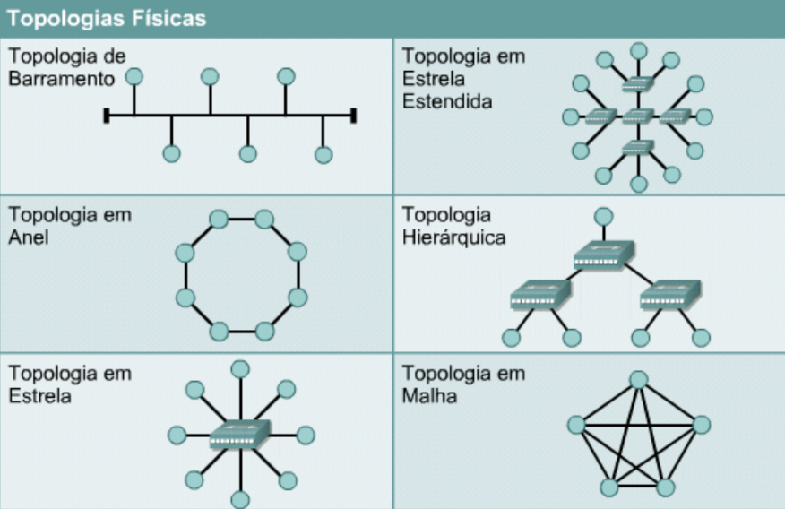

## Topologias Lógicas

### Broadcast

Significa que cada host envia seus dados a todos os outros hosts conectados ao meio físico da rede. Não existe uma ordem que deve ser seguida pelas estações para usar a rede. A ordem é: primeiro a chegar, primeiro a usar.

### Passagem de token

Controla o acesso à rede, passando um token eletrônico sequencialmente para cada host. Quando um host recebe o token, significa que esse host pode enviar dados na rede. Se o host não tiver dados a serem enviados, ele vai passar o token para o próximo host e o processo será repetido.

**Exemplo:** Token Ring e Fiber Distributed Data Interface (FDDI). Uma variação do Token Ring e FDDI é Arcnet. Arcnet é passagem de token em uma topologia de barramento.

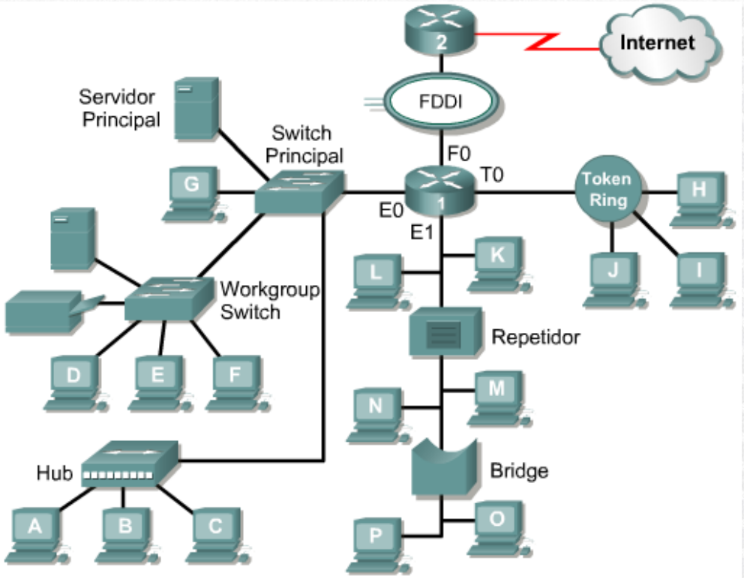

---

# Protocolos de Rede

- Conjuntos de protocolos (**protocol suites**) são coleções de protocolos que permitem a comunicação de um host para outro através da rede.

- **Um protocolo** é uma descrição formal de um conjunto de regras e convenções que governam a maneira de comunicação entre os dispositivos em uma rede.

- **Os protocolos determinam** o formato, temporização, sequência, e controle de erros na comunicação de dados.

- **Sem os protocolos**, o computador não pode criar ou reconstruir o fluxo de bits recebido de outro computador no seu formato original.

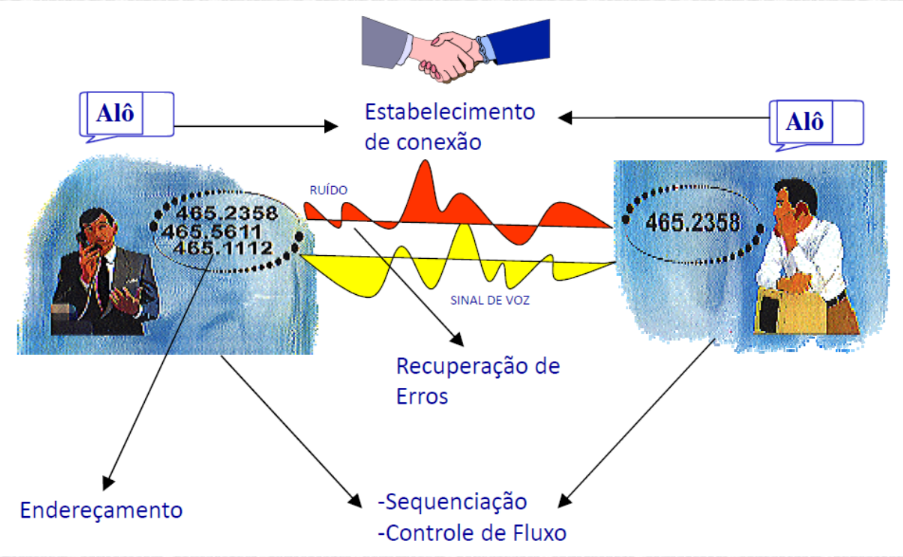

### Exemplos de Protocolos

- SMTP
- HTTP/HTTPS
- SNMP
- CSMA/CD
- IP
- IPV6
- ICMP
- ARP
- RARP
- TCP
- UDP
- X.25
- Frame-Relay
- ATM
- PPP
- HDLC
- MPLS

---
