# Meios Físicos para Redes

**Os 3 principais meios utilizados são:**

**1. Meios em cobre:** são usados em quase todas as redes locais. Estão disponíveis vários diferentes tipos, cada um com suas vantagens e desvantagens. O cobre transporta informações usando corrente elétrica.

**2. Meios ópticos:** meio mais frequentemente usado para as transmissões ponto-a-ponto, a grandes distâncias, e com alta largura de banda, necessárias para backbones das redes locais e em WANs. Converte sinais elétricos em luz para transmitir dados através de uma fibra fina de vidro ou plástico, onde o receptor converte de modo inverso.

**3. Meios sem fio:** apesar do seu grande avanço, ainda apresenta limitações nas transferências em alta velocidade, segurança ou confiabilidade, comparadas às redes cabeadas. Portanto, a flexibilidade da tecnologia sem fio justifica o uso desse meio físico.

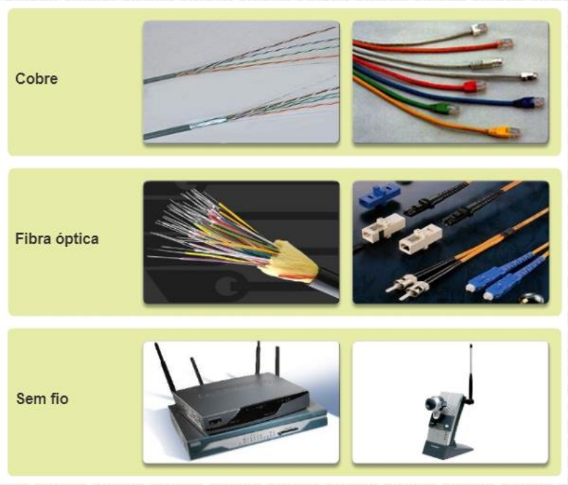

## Meios em Cobre

Os materiais através dos quais flui a corrente oferecem graus variáveis de oposição, ou resistência, ao movimento dos elétrons. A quantidade de resistência depende da composição química dos materiais.

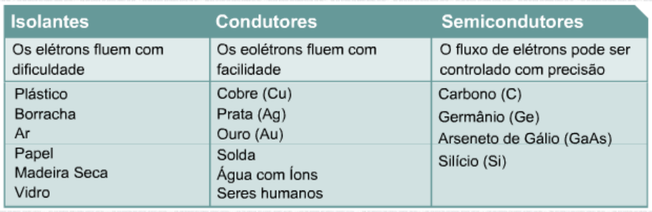

### Tipos de Cabeamento

#### Cabo Coaxial

O **cabo coaxial** consiste em um condutor de cobre envolto por uma camada isolante flexível.

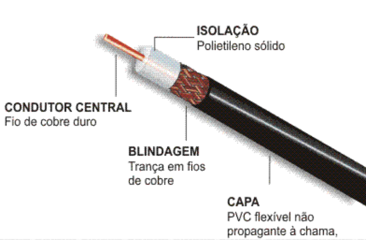

#### Cabo STP

O **cabo de par trançado blindado (STP)** combina as técnicas de blindagem, cancelamento e trançamento de fios.

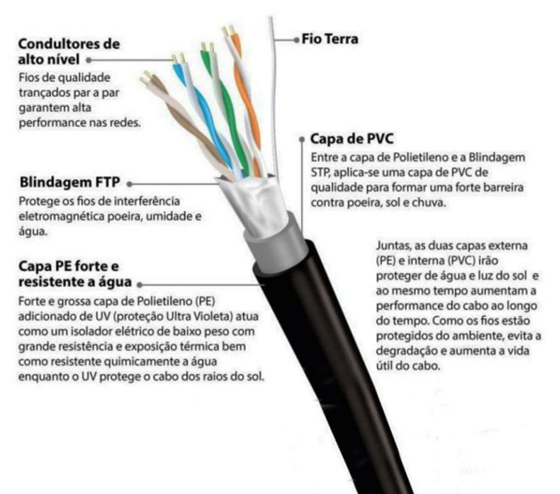

#### Cabo UTP

O **cabo de par trançado não blindado (UTP)**, com fios de 4 pares.

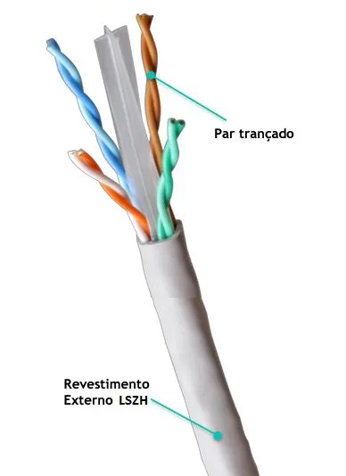

#### Conector RJ 45

**Lembrete:** Utilizado nos cabos STP e UTP

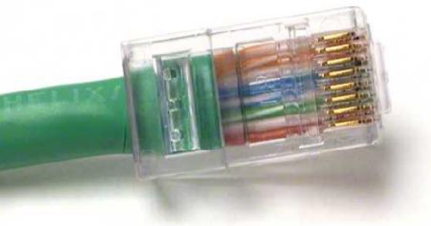

##### Padrões de Crimpagem

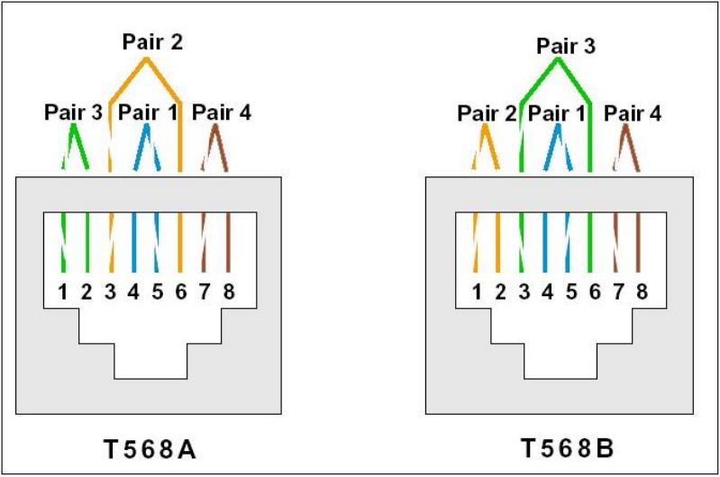

**T568A** e **T568B** são os dois padrões de organização dos fios no conector RJ-45.

- **T568A:** Ordem dos pinos (da esquerda para a direita com o conector virado pra você)

1. Branco/Verde

1. Verde

1. Branco/Laranja

1. Azul

1. Branco/Azul

1. Laranja

1. Branco/Marrom

1. Marrom

- **T568B:** Ordem dos pinos (da esquerda para a direita com o conector virado pra você)

1. Branco/Laranja

1. Laranja

1. Branco/Verde

1. Azul

1. Branco/Azul

1. Verde

1. Branco/Marrom

1. Marrom

##### Cabo Direto

O cabo direto (straight-through) conecta dispositivos de tipos diferentes, como:

- PC → Switch

- Switch → Roteador

- PC → Hub

Como ele é montado: Usa o mesmo padrão nos dois lados (geralmente T568B em ambos os conectores RJ-45).

Pinos conectam direto: 1 com 1, 2 com 2, 3 com 3, etc.

Transmissão: PC envia nos pinos 1 (TX+) e 2 (TX-)

Switch recebe nesses mesmos pinos.

##### Cabo Cruzado

O cabo cruzado (crossover) é usado para conectar dispositivos do mesmo tipo, como:

- PC → PC

- Switch → Switch

- Hub → Hub

Como ele é montado: Um lado com T568A e o outro com T568B.

Os pares de transmissão e recepção são invertidos:

- Pino 1 ↔ Pino 3

- Pino 2 ↔ Pino 6

Os demais permanecem iguais.

Transmissão: O que um envia, o outro recebe — por isso os fios são cruzados.

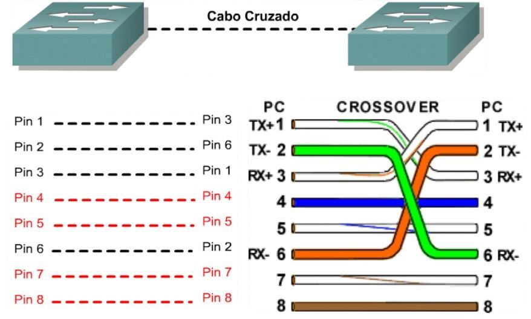

### Atenuação em Meios de Cobre

- É a **redução da amplitude do sinal** ao longo de um link.

- Longos comprimentos de cabos e altas frequências de sinais contribuem para uma maior **atenuação** dos sinais.

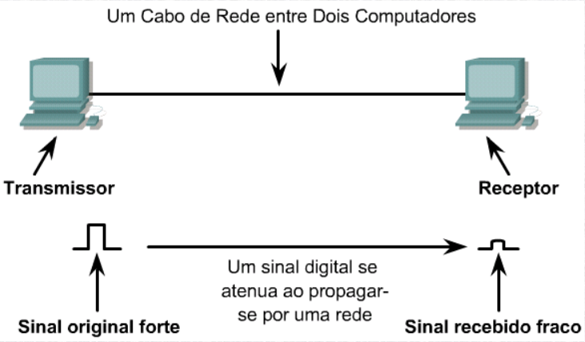

## Meios Ópticos

A luz usada nas redes de fibra óptica é um tipo de energia eletromagnética. Esta energia na forma de ondas pode deslocar-se através de um vácuo, o ar, e através de alguns materiais como vidro. O comprimento da onda de uma onda eletromagnética é determinado pela frequência com que a carga elétrica que gera a onda se desloca para lá e para cá.

**O cabeamento de fibra óptica é usado agora em quatro tipos de setor:**

- **Redes empresariais:** a fibra é usada para aplicativos de cabeamento de backbone e para a interconexão de dispositivos de infraestrutura.

- **FTTH e redes de acesso:** A Fibra para o lar (FTTH, Fiber-to-the-home) é usada para proporcionar serviços de banda larga sempre ativos para residências e pequenas empresas. A FTTH suporta o acesso à Internet de alta velocidade economicamente acessível, bem como a telecomunicação, a telemedicina e o vídeo sob demanda.

- **Redes de longo alcance:** os provedores de serviços usam redes de fibra óptica terrestres de longo alcance para conectar cidades e países. As redes geralmente variam de algumas dúzias para poucos milhares de quilômetros e usam sistemas baseados em até 10 Gb/s.

- **Redes submarinas:** os cabos especiais de fibra são usados para fornecer alta velocidade confiável, soluções de alta capacidade, capazes de sobreviver em ambientes submarinos agressivos até distâncias transoceânicas.

### Cabo da Fibra Óptica

- **Núcleo:** consiste no vidro puro e é a parte da fibra em que a luz é transportada.

- **Revestimento interno:** o vidro que envolve o núcleo e atua como um espelho. Os pulsos de luz se propagam abaixo do núcleo enquanto o revestimento interno reflete os pulsos de luz. Isso mantém os pulsos de luz contidos no núcleo da fibra em um fenômeno conhecido como a reflexão interna total.

- **Capa:** normalmente, uma capa de PVC que protege o núcleo e o revestimento interno. Pode também incluir materiais de reforço e um buffer (revestimento) cuja finalidade é proteger o vidro de arranhões e umidade.

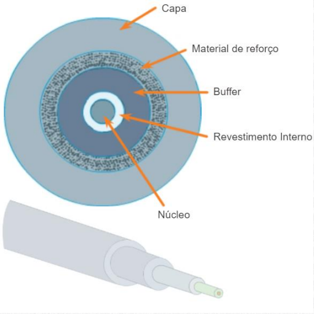

#### Tipos

##### Monomodo

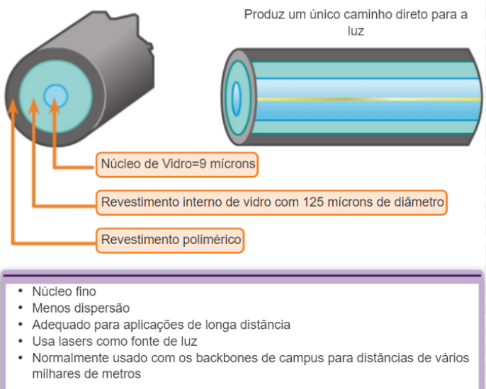

##### Multimodo

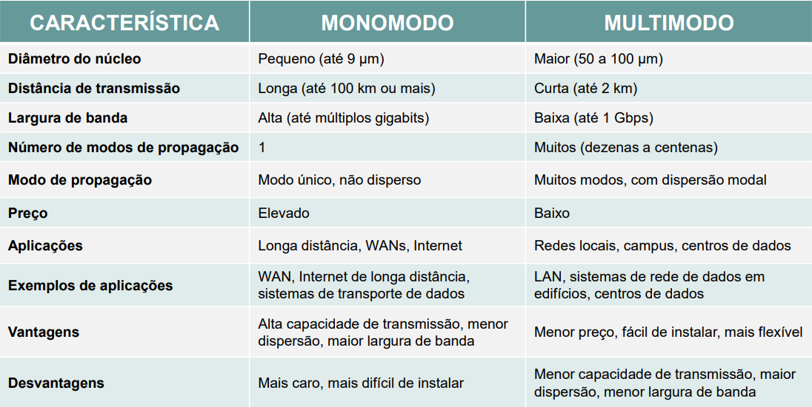

#### Outros Componentes Ópticos

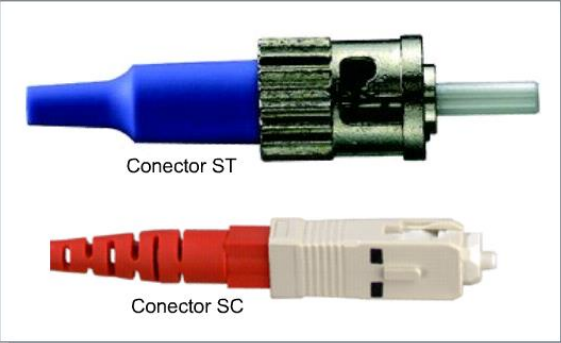

- O tipo de conector mais comumente usado com a fibra monomodo é o **SC (Standard Connector)**.

- Na fibra multimodo, o conector **ST (Straight Tip)** é usado frequentemente.

### Sinais e Ruídos em Fibras Ópticas

**Apesar de que a fibra é a melhor de todos os meios de transmissão no transporte de grandes quantidades de dados por longas distâncias, a fibra não está isenta de problemas:**

- A dispersão da luz na fibra é causada pela falta de uniformidade microscópica (distorções) na fibra que reflete e dispersa um pouco da energia da luz;

- Quando um raio de luz atinge algum tipo de impureza química em uma fibra, as impurezas absorvem parte da energia, sendo convertida em pequenas quantidades de energia térmica;

- Outro fator que causa a atenuação são irregularidades de fabricação, pois quaisquer imperfeições microscópicas na espessura ou simetria da fibra diminuirão a reflexão interna total e o revestimento interno absorverá um pouco da energia da luz.

## Meios Sem Fio

Transporta **sinais eletromagnéticos** que representam os dígitos binários de comunicações de dados usando frequências de rádio ou de micro-ondas.

**PREOCUPAÇÕES:**

- **Área de cobertura:** Quando não utilizada em ambientes abertos, alguns materiais de construção usados em prédios e estruturas, e o terreno local, limitarão a eficácia da cobertura.

- **Interferência:** Pode ser interrompida por dispositivos comuns, como telefones sem fio, alguns tipos de lâmpadas fluorescentes, fornos micro-ondas e outras comunicações sem fio.

- **Segurança:** Dispositivos e usuários que não estão autorizados a acessar a rede podem obter acesso à transmissão. Portanto, a segurança da rede é o principal componente da administração de uma rede sem fio.

### Padrões

Os 3 padrões de comunicação de dados comuns que se aplicam ao meio físico sem fio são:

- **Padrão IEEE 802.11:** a tecnologia de LAN sem fio (WLAN), geralmente chamada de Wi-Fi, usa um processo de acesso ao meio físico por acesso múltiplo com verificação de portadora para múltiplo acesso/proteção contra colisão (CSMA/CA).

- **Padrão IEEE 802.15:** padrão Rede pessoal sem fio (WPAN), conhecido como "Bluetooth", usa um processo de pareamento de dispositivo para se comunicar a distâncias entre 1 e 100 metros.

- **Padrão IEEE 802.16:** mais conhecido como WiMAX (Interoperabilidade mundial para acesso de micro- ondas), usa uma topologia ponto a multiponto para fornecer acesso de banda larga sem fio.

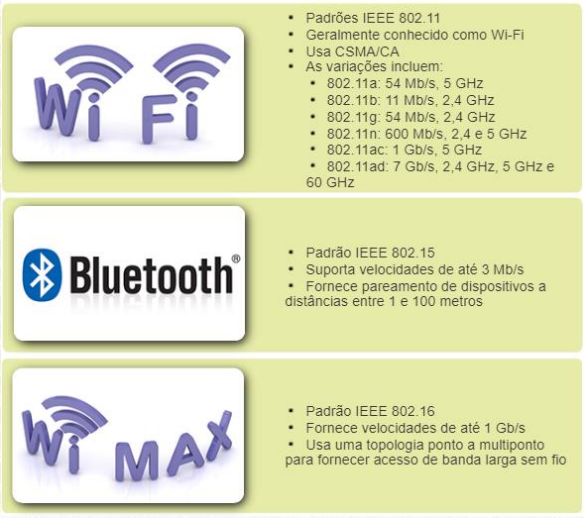

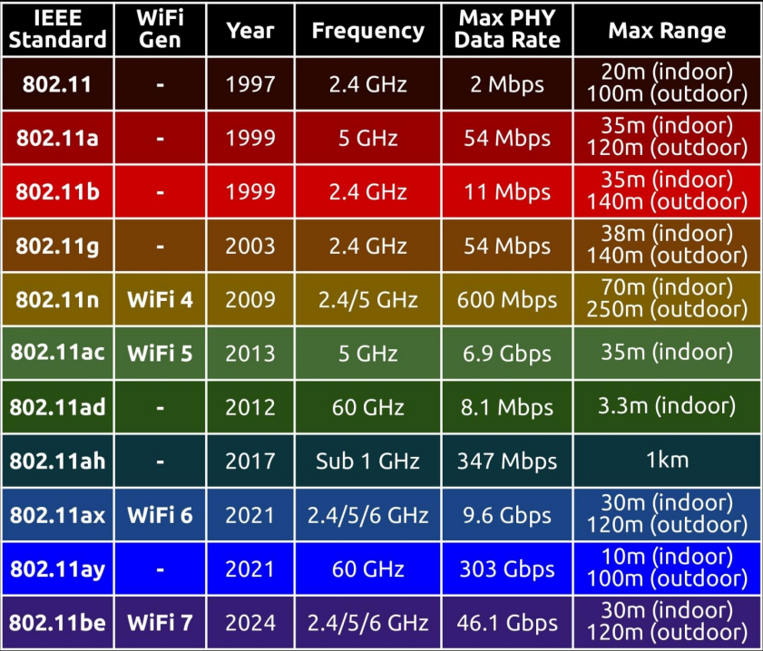

### Topologias e Dispositivos Sem Fio

O ponto de acesso (AP) é comumente instalado para agir como hub central para o modo de infra-estrutura da WLAN.

O AP é ligado através de fios à rede local cabeada para fornecer acesso à Internet e conectividade à rede cabeada.

Os APS são equipados com antenas e fornecem conectividade sem-fio através de determinadas áreas conhecidas como células.

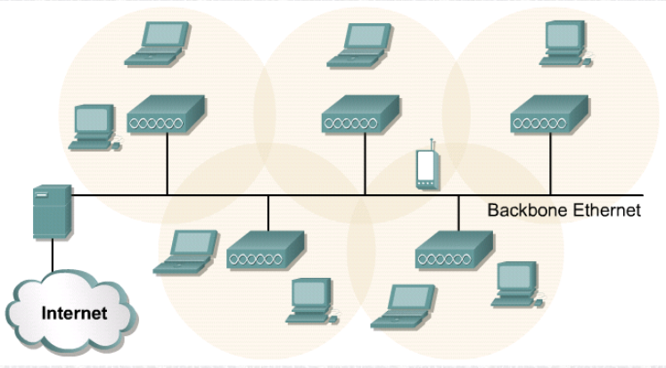

O desempenho na rede será afetado pela **intensidade do sinal** (RSSI ,Received Signal Strength Indication) e pela degradação da qualidade do sinal devido à distância ou interferência.

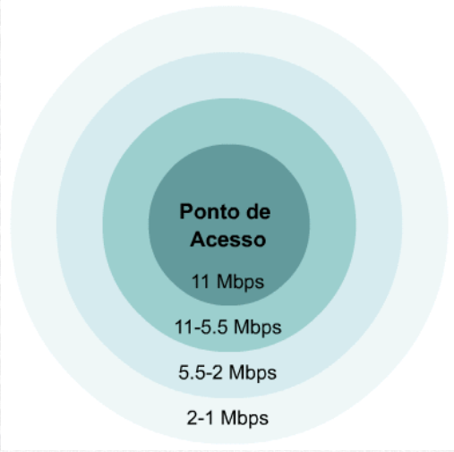
